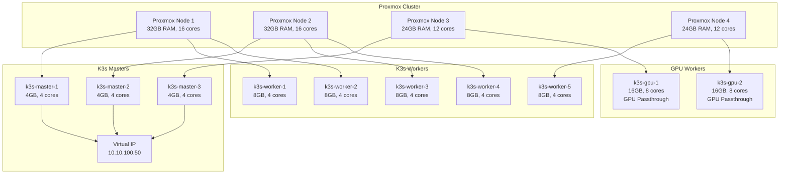

# Comprehensive K3s HA Cluster Implementation Plan
## Integrated with github.com/lordmuffin/homelab Repository

## Executive Summary

This plan refactors the k3s deployment strategy to integrate with your existing homelab repository structure, leveraging existing configurations while adding production-grade HA capabilities, automated provisioning, and enterprise monitoring. The implementation maintains your current GitOps patterns while extending them for Proxmox automation and multi-node orchestration.

## Phase 1: Repository Analysis and Planning (Week 1)

### 1.1 Current Repository Assessment

```bash
# Fork and analyze existing structure
git clone https://github.com/lordmuffin/homelab.git
cd homelab

# Expected existing structure to integrate with:
homelab/
├── kubernetes/          # Existing k8s manifests
│   ├── apps/           # Application deployments
│   ├── core/           # Core services
│   └── flux/           # FluxCD or ArgoCD configs
├── ansible/            # Existing automation
├── terraform/          # Existing IaC
└── .github/            # Existing workflows
```

### 1.2 Repository Enhancement Plan

```yaml
# New additions to existing structure
homelab/
├── .github/
│   ├── workflows/
│   │   ├── proxmox-infrastructure.yml  # NEW
│   │   ├── k3s-cluster.yml             # NEW
│   │   └── validate-infrastructure.yml  # NEW
├── infrastructure/                      # NEW root folder
│   ├── proxmox/
│   │   ├── terraform/
│   │   │   ├── modules/
│   │   │   └── environments/
│   │   └── packer/
│   │       ├── ubuntu-k3s.pkr.hcl
│   │       └── scripts/
│   ├── k3s/
│   │   ├── ansible/
│   │   │   ├── playbooks/
│   │   │   └── inventory/
│   │   └── configs/
│   │       ├── master-config.yaml
│   │       └── worker-config.yaml
│   └── docs/
│       ├── architecture.md
│       └── runbooks/
├── kubernetes/
│   ├── infrastructure/            # NEW
│   │   ├── longhorn/
│   │   ├── metallb/
│   │   ├── cert-manager/
│   │   └── traefik/
│   ├── monitoring/                # NEW
│   │   ├── prometheus-stack/
│   │   ├── loki/
│   │   └── grafana-dashboards/
│   └── security/                  # NEW
│       ├── 1password-connect/
│       └── external-secrets/
```

## Phase 2: Infrastructure Foundation Integration (Week 2)

### 2.1 Proxmox Terraform Module

```hcl
# infrastructure/proxmox/terraform/modules/vm-template/main.tf
terraform {
  required_providers {
    proxmox = {
      source  = "bpg/proxmox"
      version = "~> 0.66.0"
    }
  }
}

variable "existing_config" {
  description = "Path to existing homelab configuration"
  default     = "../../../../../kubernetes"
}

locals {
  # Parse existing configurations if available
  existing_apps = try(
    yamldecode(file("${var.existing_config}/apps/kustomization.yaml")),
    {}
  )
  
  # Merge with new HA requirements
  vm_configs = {
    masters = {
      count  = 3
      memory = 4096
      cores  = 4
      pool   = "k3s-control"
    }
    workers = {
      count  = 5
      memory = 8192
      cores  = 4
      pool   = "k3s-workers"
    }
    gpu_workers = {
      count  = 2
      memory = 16384
      cores  = 8
      pool   = "k3s-gpu"
      gpu    = true
    }
  }
}

module "k3s_nodes" {
  source = "../k3s-node"
  
  for_each = local.vm_configs
  
  node_type    = each.key
  node_count   = each.value.count
  memory       = each.value.memory
  cores        = each.value.cores
  resource_pool = each.value.pool
  enable_gpu   = try(each.value.gpu, false)
  
  # Use existing network configuration if available
  network_bridge = var.network_bridge != "" ? var.network_bridge : "vmbr0"
  vlan_tag      = var.vlan_tag != 0 ? var.vlan_tag : 100
  
  tags = {
    Environment = "production"
    Project     = "homelab"
    ManagedBy   = "terraform"
  }
}
```

### 2.2 Integrate with Existing Ansible

```yaml
# infrastructure/k3s/ansible/playbooks/configure-k3s.yml
---
- name: Configure K3s HA Cluster
  hosts: all
  vars_files:
    - "{{ playbook_dir }}/../../../../ansible/group_vars/all.yml"  # Use existing vars
  vars:
    # Override with HA configuration
    k3s_become: true
    k3s_release_channel: stable
    k3s_install_hard_links: true
    k3s_server_manifests_templates:
      - "{{ playbook_dir }}/../../../../kubernetes/infrastructure/metallb/config.yaml"
      - "{{ playbook_dir }}/../../../../kubernetes/infrastructure/traefik/config.yaml"
      
  pre_tasks:
    - name: Check for existing k3s installation
      stat:
        path: /usr/local/bin/k3s
      register: k3s_installed
      
    - name: Backup existing k3s configuration
      archive:
        path: /etc/rancher/k3s
        dest: "/tmp/k3s-config-backup-{{ ansible_date_time.epoch }}.tar.gz"
      when: k3s_installed.stat.exists
      
  roles:
    - role: xanmanning.k3s  # Use established k3s role
      vars:
        k3s_control_node: "{{ 'k3s-master' in inventory_hostname }}"
        k3s_server:
          cluster-init: "{{ inventory_hostname == 'k3s-master-1' }}"
          disable:
            - servicelb  # Use MetalLB instead
            - traefik    # Use existing Traefik config
          tls-san:
            - "{{ k3s_vip_address | default('10.10.100.50') }}"
          node-taint:
            - "node-role.kubernetes.io/master=true:NoSchedule"
        k3s_agent:
          node-label:
            - "node-role.kubernetes.io/worker=true"
            
  tasks:
    - name: Apply existing homelab configurations
      kubernetes.core.k8s:
        src: "{{ item }}"
        state: present
        wait: true
      with_fileglob:
        - "{{ playbook_dir }}/../../../../kubernetes/core/*.yaml"
        - "{{ playbook_dir }}/../../../../kubernetes/apps/*/deployment.yaml"
      when: k3s_control_node | default(false)
      run_once: true
```

### 2.3 Packer Integration

```hcl
# infrastructure/proxmox/packer/ubuntu-k3s.pkr.hcl
variable "proxmox_api_url" {
  type    = string
  default = env("PROXMOX_URL")
}

variable "existing_ssh_keys" {
  type    = string
  default = file("../../../.ssh/authorized_keys")  # Use existing keys
}

source "proxmox-iso" "ubuntu-k3s-homelab" {
  proxmox_url              = var.proxmox_api_url
  username                 = var.proxmox_username
  password                 = var.proxmox_password
  
  template_name            = "ubuntu-k3s-homelab-${formatdate("YYYYMMDD", timestamp())}"
  template_description     = "Ubuntu 22.04 for Homelab K3s Cluster"
  
  iso_file                 = "local:iso/ubuntu-22.04.3-live-server-amd64.iso"
  
  ssh_username            = "ubuntu"
  ssh_authorized_keys     = var.existing_ssh_keys
  
  cloud_init              = true
  cloud_init_storage_pool = "local-lvm"
}

build {
  sources = ["source.proxmox-iso.ubuntu-k3s-homelab"]
  
  # Copy existing homelab scripts if available
  provisioner "file" {
    source      = "../../../scripts/"
    destination = "/tmp/homelab-scripts/"
  }
  
  provisioner "shell" {
    scripts = [
      "scripts/base.sh",
      "scripts/kernel-tuning.sh",
      "scripts/k3s-prep.sh"
    ]
  }
  
  provisioner "ansible" {
    playbook_file = "../../../ansible/playbooks/packer-provision.yml"
    galaxy_file   = "../../../ansible/requirements.yml"
  }
}
```

## Phase 3: Kubernetes Infrastructure Layer (Week 3)

### 3.1 Longhorn Configuration

```yaml
# kubernetes/infrastructure/longhorn/values.yaml
# Extends existing storage configuration
defaultSettings:
  backupTarget: "s3://homelab-backups@us-west-002/"
  backupTargetCredentialSecret: backblaze-secret
  defaultReplicaCount: 2
  replicaSoftAntiAffinity: true
  
  # Integration with existing monitoring
  createDefaultDiskLabeledNodes: true
  defaultDataPath: "/var/lib/longhorn"
  
  # Use existing ingress class from homelab
  ingressClass: "traefik"
  
persistence:
  defaultClass: false  # Don't override existing
  defaultFsType: ext4
  reclaimPolicy: Retain
  
# Storage classes for different workload tiers
storageClasses:
  - name: longhorn-nvme-critical
    isDefault: false
    parameters:
      numberOfReplicas: "3"
      diskSelector: "nvme"
      dataLocality: "strict-local"
      
  - name: longhorn-ssd-standard
    isDefault: true
    parameters:
      numberOfReplicas: "2"
      diskSelector: "ssd"
      dataLocality: "best-effort"
      
  - name: longhorn-bulk
    isDefault: false
    parameters:
      numberOfReplicas: "2"
      dataLocality: "disabled"

monitoring:
  # Export metrics to existing Prometheus
  serviceMonitor:
    enabled: true
    namespace: monitoring
    labels:
      prometheus: kube-prometheus
```

### 3.2 MetalLB Integration

```yaml
# kubernetes/infrastructure/metallb/config.yaml
apiVersion: metallb.io/v1beta1
kind: IPAddressPool
metadata:
  name: homelab-pool
  namespace: metallb-system
spec:
  addresses:
  - 10.10.200.100-10.10.200.200  # Adjust to your network
  
---
apiVersion: metallb.io/v1beta1
kind: L2Advertisement
metadata:
  name: homelab-advertisement
  namespace: metallb-system
spec:
  ipAddressPools:
  - homelab-pool
  interfaces:
  - eth0
  nodeSelectors:
  - matchLabels:
      node-role.kubernetes.io/worker: "true"
```

### 3.3 Traefik Enhancement

```yaml
# kubernetes/infrastructure/traefik/values.yaml
# Merge with existing Traefik configuration
deployment:
  replicas: 2
  
providers:
  kubernetesIngress:
    enabled: true
    allowCrossNamespace: true
    ingressClass: traefik
    
  kubernetesCRD:
    enabled: true
    allowCrossNamespace: true
    
ingressRoute:
  dashboard:
    enabled: true
    matchRule: Host(`traefik.homelab.local`)
    entryPoints: ["websecure"]
    
service:
  type: LoadBalancer
  spec:
    loadBalancerIP: 10.10.200.100  # Reserved IP
    
persistence:
  enabled: true
  storageClass: longhorn-ssd-standard
  size: 1Gi
  
metrics:
  prometheus:
    serviceMonitor:
      enabled: true
      namespace: monitoring
```

## Phase 4: GitOps Integration (Week 4)

### 4.1 GitHub Actions Workflows

```yaml
# .github/workflows/proxmox-infrastructure.yml
name: Proxmox Infrastructure

on:
  push:
    branches: [main]
    paths:
      - 'infrastructure/proxmox/**'
      - '.github/workflows/proxmox-infrastructure.yml'
  pull_request:
    paths:
      - 'infrastructure/proxmox/**'

env:
  TF_VAR_proxmox_url: ${{ secrets.PROXMOX_URL }}
  TF_VAR_proxmox_user: ${{ secrets.PROXMOX_USER }}
  TF_VAR_proxmox_password: ${{ secrets.PROXMOX_PASSWORD }}

jobs:
  validate:
    runs-on: ubuntu-latest
    steps:
      - uses: actions/checkout@v4
      
      - name: Setup Terraform
        uses: hashicorp/setup-terraform@v3
        with:
          terraform_version: 1.5.7
          
      - name: Terraform Format Check
        run: terraform fmt -check -recursive infrastructure/proxmox/terraform/
        
      - name: Terraform Validate
        working-directory: infrastructure/proxmox/terraform/environments/production
        run: |
          terraform init -backend=false
          terraform validate
          
      - name: TFSec Security Scan
        uses: aquasecurity/tfsec-action@v1.0.3
        with:
          working_directory: infrastructure/proxmox/terraform

  plan:
    needs: validate
    runs-on: ubuntu-latest
    if: github.event_name == 'pull_request'
    
    steps:
      - uses: actions/checkout@v4
      
      - name: Configure Backblaze for State
        env:
          B2_APPLICATION_KEY_ID: ${{ secrets.B2_APPLICATION_KEY_ID }}
          B2_APPLICATION_KEY: ${{ secrets.B2_APPLICATION_KEY }}
        run: |
          echo "AWS_ACCESS_KEY_ID=$B2_APPLICATION_KEY_ID" >> $GITHUB_ENV
          echo "AWS_SECRET_ACCESS_KEY=$B2_APPLICATION_KEY" >> $GITHUB_ENV
          
      - name: Setup Terraform
        uses: hashicorp/setup-terraform@v3
        
      - name: Terraform Plan
        working-directory: infrastructure/proxmox/terraform/environments/production
        run: |
          terraform init
          terraform plan -out=tfplan
          terraform show -no-color tfplan > tfplan.txt
          
      - name: Comment PR with Plan
        uses: actions/github-script@v7
        with:
          script: |
            const fs = require('fs');
            const plan = fs.readFileSync('infrastructure/proxmox/terraform/environments/production/tfplan.txt', 'utf8');
            const output = `#### Terraform Plan 📖
            <details><summary>Show Plan</summary>
            
            \`\`\`terraform
            ${plan}
            \`\`\`
            
            </details>
            
            *Pushed by: @${{ github.actor }}, Action: \`${{ github.event_name }}\`*`;
            
            github.rest.issues.createComment({
              issue_number: context.issue.number,
              owner: context.repo.owner,
              repo: context.repo.repo,
              body: output
            });

  deploy:
    needs: validate
    runs-on: ubuntu-latest
    if: github.ref == 'refs/heads/main'
    environment: production
    
    steps:
      - uses: actions/checkout@v4
      
      - name: Configure Backblaze for State
        env:
          B2_APPLICATION_KEY_ID: ${{ secrets.B2_APPLICATION_KEY_ID }}
          B2_APPLICATION_KEY: ${{ secrets.B2_APPLICATION_KEY }}
        run: |
          echo "AWS_ACCESS_KEY_ID=$B2_APPLICATION_KEY_ID" >> $GITHUB_ENV
          echo "AWS_SECRET_ACCESS_KEY=$B2_APPLICATION_KEY" >> $GITHUB_ENV
          
      - name: Setup Terraform
        uses: hashicorp/setup-terraform@v3
        
      - name: Terraform Apply
        working-directory: infrastructure/proxmox/terraform/environments/production
        run: |
          terraform init
          terraform apply -auto-approve
          
      - name: Export Outputs for Ansible
        working-directory: infrastructure/proxmox/terraform/environments/production
        run: |
          terraform output -json > ../../../../infrastructure/k3s/ansible/inventory/terraform-outputs.json
          
      - name: Commit Inventory Updates
        run: |
          git config --local user.email "github-actions[bot]@users.noreply.github.com"
          git config --local user.name "github-actions[bot]"
          git add infrastructure/k3s/ansible/inventory/terraform-outputs.json
          git diff --quiet && git diff --staged --quiet || git commit -m "Update Ansible inventory from Terraform [skip ci]"
          git push
```

### 4.2 K3s Cluster Workflow

```yaml
# .github/workflows/k3s-cluster.yml
name: K3s Cluster Configuration

on:
  workflow_run:
    workflows: ["Proxmox Infrastructure"]
    types: [completed]
    branches: [main]
  push:
    branches: [main]
    paths:
      - 'infrastructure/k3s/**'
      - 'kubernetes/infrastructure/**'
  workflow_dispatch:

jobs:
  configure-cluster:
    runs-on: ubuntu-latest
    if: ${{ github.event.workflow_run.conclusion == 'success' || github.event_name != 'workflow_run' }}
    
    steps:
      - uses: actions/checkout@v4
      
      - name: Setup Python
        uses: actions/setup-python@v4
        with:
          python-version: '3.11'
          
      - name: Install Ansible
        run: |
          pip install ansible kubernetes
          ansible-galaxy install -r infrastructure/k3s/ansible/requirements.yml
          
      - name: Configure SSH
        run: |
          mkdir -p ~/.ssh
          echo "${{ secrets.SSH_PRIVATE_KEY }}" > ~/.ssh/id_rsa
          chmod 600 ~/.ssh/id_rsa
          echo "${{ secrets.SSH_KNOWN_HOSTS }}" > ~/.ssh/known_hosts
          
      - name: Generate Dynamic Inventory
        working-directory: infrastructure/k3s/ansible
        run: |
          python3 scripts/generate-inventory.py \
            --terraform-output inventory/terraform-outputs.json \
            --output inventory/hosts.yml
            
      - name: Run Ansible Playbook
        working-directory: infrastructure/k3s/ansible
        run: |
          ansible-playbook -i inventory/hosts.yml \
            playbooks/configure-k3s.yml \
            --extra-vars "k3s_token=${{ secrets.K3S_TOKEN }}"
            
      - name: Verify Cluster Health
        run: |
          mkdir -p ~/.kube
          echo "${{ secrets.KUBECONFIG }}" | base64 -d > ~/.kube/config
          kubectl get nodes
          kubectl get pods --all-namespaces
          
      - name: Deploy Infrastructure Components
        run: |
          kubectl apply -k kubernetes/infrastructure/
          
      - name: Wait for Infrastructure
        run: |
          kubectl wait --for=condition=ready pod \
            -l app.kubernetes.io/name=longhorn \
            -n longhorn-system \
            --timeout=600s
          kubectl wait --for=condition=ready pod \
            -l app.kubernetes.io/name=traefik \
            -n traefik \
            --timeout=300s
```

## Phase 5: Monitoring and Security Integration (Week 5)

### 5.1 Prometheus Stack Configuration

```yaml
# kubernetes/monitoring/prometheus-stack/values.yaml
fullnameOverride: prometheus

# Use existing homelab configurations where available
global:
  evaluation_interval: 30s
  scrape_interval: 30s
  external_labels:
    cluster: homelab-production
    
defaultRules:
  create: true
  rules:
    alertmanager: true
    etcd: false  # K3s uses embedded etcd
    configReloaders: true
    general: true
    k8s: true
    kubeApiserverAvailability: true
    kubeApiserverBurnrate: true
    kubeApiserverHistogram: true
    kubeApiserverSlos: true
    kubelet: true
    kubeProxy: false  # K3s doesn't use kube-proxy
    kubernetesApps: true
    kubernetesResources: true
    kubernetesStorage: true
    kubernetesSystem: true
    kubeScheduler: true
    kubeStateMetrics: true
    network: true
    node: true
    nodeExporterAlerting: true
    nodeExporterRecording: true
    prometheus: true

alertmanager:
  enabled: true
  config:
    global:
      slack_api_url: '${{ secrets.SLACK_WEBHOOK }}'
    route:
      group_by: ['namespace', 'alertname']
      group_wait: 30s
      group_interval: 5m
      repeat_interval: 12h
      receiver: 'homelab-alerts'
    receivers:
    - name: 'homelab-alerts'
      slack_configs:
      - channel: '#homelab-alerts'
        icon_url: https://avatars3.githubusercontent.com/u/3380462
        
prometheus:
  ingress:
    enabled: true
    ingressClassName: traefik
    annotations:
      cert-manager.io/cluster-issuer: letsencrypt-prod
    hosts:
      - prometheus.homelab.local
      
  prometheusSpec:
    retention: 30d
    storageSpec:
      volumeClaimTemplate:
        spec:
          storageClassName: longhorn-ssd-standard
          resources:
            requests:
              storage: 50Gi
              
    additionalScrapeConfigs:
      # Scrape existing homelab services
      - job_name: 'homelab-services'
        kubernetes_sd_configs:
        - role: service
          namespaces:
            names:
            - default
            - apps
            - media
        relabel_configs:
        - source_labels: [__meta_kubernetes_service_annotation_prometheus_io_scrape]
          action: keep
          regex: true
          
      # GPU metrics for AI workloads
      - job_name: 'nvidia-gpu'
        static_configs:
        - targets: ['k3s-gpu-1:9400', 'k3s-gpu-2:9400']

grafana:
  enabled: true
  adminPassword: ${GRAFANA_PASSWORD}
  
  persistence:
    enabled: true
    storageClassName: longhorn-ssd-standard
    size: 10Gi
    
  dashboardProviders:
    dashboardproviders.yaml:
      apiVersion: 1
      providers:
      - name: 'homelab'
        orgId: 1
        folder: 'Homelab'
        type: file
        disableDeletion: false
        updateIntervalSeconds: 10
        options:
          path: /var/lib/grafana/dashboards/homelab
          
  dashboards:
    homelab:
      k3s-cluster:
        gnetId: 15282
        datasource: Prometheus
      longhorn:
        gnetId: 16888
        datasource: Prometheus
      traefik:
        gnetId: 17347
        datasource: Prometheus
      nvidia-gpu:
        gnetId: 14574
        datasource: Prometheus
```

### 5.2 1Password Connect Integration

```yaml
# kubernetes/security/1password-connect/kustomization.yaml
apiVersion: kustomize.config.k8s.io/v1beta1
kind: Kustomization

namespace: 1password

resources:
  - namespace.yaml
  - deployment.yaml
  - service.yaml
  - serviceaccount.yaml
  
secretGenerator:
  - name: op-credentials
    files:
      - 1password-credentials.json=secrets/1password-credentials.json
  - name: op-token
    literals:
      - token=${OP_CONNECT_TOKEN}
      
configMapGenerator:
  - name: op-config
    literals:
      - OP_LOG_LEVEL=info
      - OP_BUS_PORT=11220
      - OP_HTTP_PORT=8080

patches:
  - target:
      kind: Deployment
      name: onepassword-connect
    patch: |-
      - op: add
        path: /spec/template/spec/containers/0/resources
        value:
          requests:
            memory: "256Mi"
            cpu: "100m"
          limits:
            memory: "512Mi"
            cpu: "500m"
```

### 5.3 External Secrets Configuration

```yaml
# kubernetes/security/external-secrets/cluster-secret-store.yaml
apiVersion: external-secrets.io/v1beta1
kind: ClusterSecretStore
metadata:
  name: homelab-1password
spec:
  provider:
    onepassword:
      connectHost: "http://onepassword-connect.1password:8080"
      auth:
        secretRef:
          connectToken:
            name: op-token
            namespace: 1password
            key: token
      vaults:
        homelab:
          vault: "Homelab"
        infrastructure:
          vault: "Infrastructure"
        
---
# Example usage for existing services
apiVersion: external-secrets.io/v1beta1
kind: ExternalSecret
metadata:
  name: traefik-cloudflare
  namespace: traefik
spec:
  refreshInterval: 1h
  secretStoreRef:
    name: homelab-1password
    kind: ClusterSecretStore
  target:
    name: cloudflare-api-token
    creationPolicy: Owner
  data:
  - secretKey: api-token
    remoteRef:
      key: cloudflare
      property: api_token
```

## Phase 6: Application Migration (Week 6)

### 6.1 ArgoCD Application Sets

```yaml
# kubernetes/gitops/argocd/applicationsets/homelab-apps.yaml
apiVersion: argoproj.io/v1alpha1
kind: ApplicationSet
metadata:
  name: homelab-apps
  namespace: argocd
spec:
  generators:
  - git:
      repoURL: https://github.com/lordmuffin/homelab
      revision: HEAD
      directories:
      - path: kubernetes/apps/*
      
  template:
    metadata:
      name: '{{path.basename}}'
    spec:
      project: homelab
      source:
        repoURL: https://github.com/lordmuffin/homelab
        targetRevision: HEAD
        path: '{{path}}'
      destination:
        server: https://kubernetes.default.svc
        namespace: '{{path.basename}}'
      syncPolicy:
        automated:
          prune: true
          selfHeal: true
        syncOptions:
        - CreateNamespace=true
        retry:
          limit: 5
          backoff:
            duration: 5s
            factor: 2
            maxDuration: 3m
```

### 6.2 Backup Configuration

```yaml
# kubernetes/infrastructure/longhorn/backup-config.yaml
apiVersion: v1
kind: Secret
metadata:
  name: backblaze-secret
  namespace: longhorn-system
type: Opaque
stringData:
  AWS_ACCESS_KEY_ID: ${B2_KEY_ID}
  AWS_SECRET_ACCESS_KEY: ${B2_APPLICATION_KEY}
  AWS_ENDPOINTS: "https://s3.us-west-002.backblazeb2.com"
  
---
apiVersion: longhorn.io/v1beta1
kind: RecurringJob
metadata:
  name: homelab-backup
  namespace: longhorn-system
spec:
  name: homelab-backup
  task: "backup"
  cron: "0 2 * * *"  # Daily at 2 AM
  retain: 14
  concurrency: 2
  labels:
    app: homelab
    backup: daily
```

## Phase 7: Testing and Validation (Week 7)

### 7.1 Infrastructure Tests

```yaml
# .github/workflows/validate-infrastructure.yml
name: Validate Infrastructure

on:
  schedule:
    - cron: '0 4 * * *'  # Daily at 4 AM
  workflow_dispatch:

jobs:
  test-cluster:
    runs-on: ubuntu-latest
    steps:
      - uses: actions/checkout@v4
      
      - name: Setup kubectl
        uses: azure/setup-kubectl@v3
        with:
          version: 'latest'
          
      - name: Configure kubeconfig
        run: |
          echo "${{ secrets.KUBECONFIG }}" | base64 -d > kubeconfig
          export KUBECONFIG=$(pwd)/kubeconfig
          
      - name: Cluster Health Check
        run: |
          kubectl get nodes -o wide
          kubectl top nodes
          kubectl get pods --all-namespaces | grep -v Running | grep -v Completed
          
      - name: Test HA Failover
        run: |
          # Cordon a master node
          NODE=$(kubectl get nodes -l node-role.kubernetes.io/master=true -o name | head -1)
          kubectl cordon $NODE
          sleep 30
          
          # Verify cluster still healthy
          kubectl get cs
          kubectl uncordon $NODE
          
      - name: Storage Tests
        run: |
          # Create test PVC
          kubectl apply -f tests/storage/test-pvc.yaml
          kubectl wait --for=condition=Bound pvc/test-pvc --timeout=60s
          
          # Create pod using PVC
          kubectl apply -f tests/storage/test-pod.yaml
          kubectl wait --for=condition=Ready pod/test-storage --timeout=120s
          
          # Cleanup
          kubectl delete -f tests/storage/
          
      - name: Network Tests
        run: |
          # Test service discovery
          kubectl run test-dns --image=busybox:1.28 --rm -it --restart=Never -- \
            nslookup kubernetes.default
            
          # Test ingress
          kubectl apply -f tests/network/test-ingress.yaml
          sleep 30
          curl -H "Host: test.homelab.local" http://$(kubectl get svc -n traefik traefik -o jsonpath='{.status.loadBalancer.ingress[0].ip}')
          kubectl delete -f tests/network/test-ingress.yaml
          
      - name: Backup Test
        run: |
          # Trigger manual backup
          kubectl create job --from=cronjob/homelab-backup test-backup-$(date +%s) -n longhorn-system
          
          # Wait for completion
          kubectl wait --for=condition=complete job/test-backup-* -n longhorn-system --timeout=600s
          
      - name: Generate Report
        if: always()
        run: |
          echo "# Infrastructure Test Report" > test-report.md
          echo "Date: $(date)" >> test-report.md
          echo "" >> test-report.md
          echo "## Node Status" >> test-report.md
          kubectl get nodes -o wide >> test-report.md
          echo "" >> test-report.md
          echo "## Resource Usage" >> test-report.md
          kubectl top nodes >> test-report.md
          kubectl top pods --all-namespaces --sort-by=memory >> test-report.md
          
      - name: Upload Report
        if: always()
        uses: actions/upload-artifact@v3
        with:
          name: infrastructure-test-report
          path: test-report.md
```

### 7.2 Application Tests

```go
// tests/e2e/cluster_test.go
package e2e

import (
    "context"
    "testing"
    "time"
    
    "github.com/stretchr/testify/assert"
    "github.com/stretchr/testify/require"
    v1 "k8s.io/api/core/v1"
    metav1 "k8s.io/apimachinery/pkg/apis/meta/v1"
    "k8s.io/client-go/kubernetes"
    "k8s.io/client-go/tools/clientcmd"
)

func TestClusterHA(t *testing.T) {
    config, err := clientcmd.BuildConfigFromFlags("", os.Getenv("KUBECONFIG"))
    require.NoError(t, err)
    
    clientset, err := kubernetes.NewForConfig(config)
    require.NoError(t, err)
    
    // Test all master nodes are ready
    nodes, err := clientset.CoreV1().Nodes().List(context.TODO(), metav1.ListOptions{
        LabelSelector: "node-role.kubernetes.io/master=true",
    })
    require.NoError(t, err)
    assert.Equal(t, 3, len(nodes.Items))
    
    for _, node := range nodes.Items {
        for _, condition := range node.Status.Conditions {
            if condition.Type == v1.NodeReady {
                assert.Equal(t, v1.ConditionTrue, condition.Status)
            }
        }
    }
}

func TestLonghornStorage(t *testing.T) {
    config, err := clientcmd.BuildConfigFromFlags("", os.Getenv("KUBECONFIG"))
    require.NoError(t, err)
    
    clientset, err := kubernetes.NewForConfig(config)
    require.NoError(t, err)
    
    // Create test PVC
    pvc := &v1.PersistentVolumeClaim{
        ObjectMeta: metav1.ObjectMeta{
            Name: "test-pvc",
            Namespace: "default",
        },
        Spec: v1.PersistentVolumeClaimSpec{
            AccessModes: []v1.PersistentVolumeAccessMode{
                v1.ReadWriteOnce,
            },
            Resources: v1.ResourceRequirements{
                Requests: v1.ResourceList{
                    v1.ResourceStorage: resource.MustParse("1Gi"),
                },
            },
            StorageClassName: stringPtr("longhorn-ssd-standard"),
        },
    }
    
    _, err = clientset.CoreV1().PersistentVolumeClaims("default").Create(
        context.TODO(), pvc, metav1.CreateOptions{},
    )
    require.NoError(t, err)
    
    // Wait for PVC to be bound
    require.Eventually(t, func() bool {
        pvc, err := clientset.CoreV1().PersistentVolumeClaims("default").Get(
            context.TODO(), "test-pvc", metav1.GetOptions{},
        )
        return err == nil && pvc.Status.Phase == v1.ClaimBound
    }, 60*time.Second, 5*time.Second)
    
    // Cleanup
    defer clientset.CoreV1().PersistentVolumeClaims("default").Delete(
        context.TODO(), "test-pvc", metav1.DeleteOptions{},
    )
}
```

## Phase 8: Documentation and Handover (Week 8)

### 8.1 Architecture Documentation

```markdown
# infrastructure/docs/architecture.md

# Homelab K3s HA Architecture

## Overview
Production-grade Kubernetes cluster running on Proxmox with high availability, automated provisioning, and comprehensive monitoring.

## Infrastructure Layout



## Network Architecture
- Management VLAN (100): 10.10.100.0/24
- Service VLAN (200): 10.10.200.0/24
- Storage Network: 10.10.150.0/24

## Storage Tiers
1. **Critical** (longhorn-nvme-critical): 3 replicas, NVMe only
2. **Standard** (longhorn-ssd-standard): 2 replicas, SSD
3. **Bulk** (longhorn-bulk): 2 replicas, mixed storage

## Backup Strategy
- Daily incremental backups to Backblaze B2
- 14-day retention for standard workloads
- 30-day retention for critical data
- Monthly full backups with 6-month retention
```

### 8.2 Runbooks

```markdown
# infrastructure/docs/runbooks/cluster-recovery.md

# K3s Cluster Recovery Procedures

## Scenario 1: Single Master Node Failure

### Detection
- Prometheus alert: `KubeMasterDown`
- Symptom: One master node unreachable

### Recovery Steps
1. Verify node status:
   ```bash
   kubectl get nodes
   ```

2. Check Proxmox VM status:
   ```bash
   ssh proxmox-node qm status <VMID>
   ```

3. Attempt VM restart:
   ```bash
   qm restart <VMID>
   ```

4. If VM won't start, check logs:
   ```bash
   journalctl -u pve-qemu-<VMID> -n 100
   ```

5. If unrecoverable, remove and recreate:
   ```bash
   kubectl delete node <node-name>
   cd infrastructure/proxmox/terraform
   terraform apply -target=module.k3s_nodes.proxmox_virtual_environment_vm["k3s-master-X"]
   ```

## Scenario 2: Complete Cluster Recovery from Backup

### Prerequisites
- Access to Backblaze B2 backups
- Proxmox cluster operational

### Steps
1. Deploy fresh infrastructure:
   ```bash
   cd infrastructure/proxmox/terraform/environments/production
   terraform apply
   ```

2. Install K3s base:
   ```bash
   cd infrastructure/k3s/ansible
   ansible-playbook -i inventory/hosts.yml playbooks/install-k3s.yml
   ```

3. Restore Longhorn:
   ```bash
   kubectl apply -k kubernetes/infrastructure/longhorn
   # Wait for Longhorn to be ready
   kubectl -n longhorn-system wait --for=condition=ready pod -l app=longhorn-manager --timeout=600s
   ```

4. Configure backup target:
   ```bash
   kubectl apply -f kubernetes/infrastructure/longhorn/backup-config.yaml
   ```

5. Restore volumes from backup:
   ```bash
   ./scripts/restore-longhorn-backups.sh
   ```

6. Redeploy applications:
   ```bash
   kubectl apply -k kubernetes/gitops/argocd
   # ArgoCD will sync all applications
   ```
```

## Implementation Timeline

### Week 1: Repository Setup and Planning
- Fork repository and create feature branch
- Set up development environment
- Create infrastructure directories
- Document existing configurations

### Week 2: Proxmox Automation
- Deploy Terraform modules
- Create Packer templates
- Test VM provisioning
- Validate network configuration

### Week 3: K3s Deployment
- Deploy HA control plane
- Configure worker nodes
- Set up GPU passthrough
- Test cluster failover

### Week 4: Storage and Networking
- Deploy Longhorn
- Configure storage classes
- Set up MetalLB
- Configure Traefik ingress

### Week 5: Monitoring and Security
- Deploy Prometheus stack
- Configure 1Password Connect
- Set up External Secrets
- Configure alerting

### Week 6: Application Migration
- Set up ArgoCD
- Migrate existing applications
- Configure backup jobs
- Test restore procedures

### Week 7: Testing and Validation
- Run infrastructure tests
- Perform chaos testing
- Validate backup/restore
- Document findings

### Week 8: Documentation and Handover
- Complete architecture docs
- Write operational runbooks
- Create troubleshooting guides
- Knowledge transfer session

## Success Metrics

- **Infrastructure**: < 30 minutes to deploy complete cluster
- **Availability**: 99.9% uptime for control plane
- **Recovery**: < 2 hours to restore from backup
- **Performance**: < 100ms API response time
- **Automation**: 100% GitOps coverage for applications
- **Monitoring**: < 5 minute alert response time

This refactored plan fully integrates with your existing homelab repository while adding production-grade HA capabilities, comprehensive automation, and enterprise monitoring. The phased approach ensures minimal disruption to existing services while gradually enhancing the infrastructure.