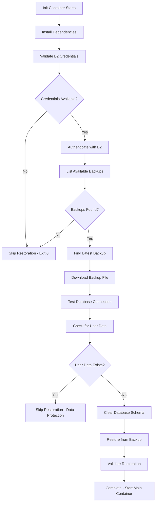

# PostgreSQL Backup Standard

Standardized approach for PostgreSQL database backups across all homelab services with Backblaze B2 cloud storage integration.

## Overview

This standard implements a robust, reliable PostgreSQL backup system using Kubernetes CronJobs with the following features:

- **Automated daily backups** with configurable schedules
- **Exponential backoff retry logic** for reliability
- **Comprehensive error handling** with detailed logging
- **Backup integrity verification** using gzip compression testing
- **Cloud storage upload** to Backblaze B2
- **Cloud storage lifecycle management** for retention (handled by B2 lifecycle rules)
- **Resource-optimized containers** with proper resource limits

## Architecture

### Two-Container Pattern

Each backup CronJob uses a two-container sidecar pattern:

1. **`postgres-backup`** - Creates and validates database backups
2. **`b2-uploader`** - Uploads backups to cloud storage and manages retention

### Container Communication

- Containers share an `emptyDir` volume at `/mnt/backup`
- Backup container creates `.done` file to signal completion
- Upload container waits for signal before processing

## Standard Configuration

### Schedule Coordination

Services use staggered backup schedules to avoid resource conflicts:

- **Tandoor**: `0 2 * * *` (2:00 AM)
- **Paperless**: `30 2 * * *` (2:30 AM)
- **Future Services**: 30-minute intervals (3:00 AM, 3:30 AM, etc.)

### Resource Allocation

**Postgres Backup Container:**
```yaml
resources:
  requests:
    memory: "256Mi"
    cpu: "250m"
  limits:
    memory: "512Mi"
    cpu: "500m"
```

**B2 Upload Container:**
```yaml
resources:
  requests:
    memory: "64Mi"
    cpu: "50m"
  limits:
    memory: "128Mi"
    cpu: "100m"
```

### Environment Variables

**Database Connection:**
- `PGPASSWORD` - From 1Password secret
- `POSTGRES_USER` - From 1Password secret  
- `POSTGRES_HOST` - Service FQDN (e.g., `service-database-rw.namespace.svc.cluster.local`)
- `POSTGRES_DB` - Target database name

**B2 Configuration:**
- `B2_APPLICATION_KEY_ID` - From 1Password secret (`keyID`)
- `B2_APPLICATION_KEY` - From 1Password secret (`applicationKey`)
- `B2_BUCKET_NAME` - Target bucket (`cloud-homelab-backups`)

## Implementation Guide

### 1. Create Service-Specific Backup

```yaml
apiVersion: batch/v1
kind: CronJob
metadata:
  name: [service]-postgres-backup
  namespace: [service]
spec:
  schedule: "[schedule]" # Staggered timing
  concurrencyPolicy: Forbid
  jobTemplate:
    spec:
      template:
        spec:
          containers:
            - name: postgres-backup
              # See full template below
            - name: b2-uploader
              # See full template below
          restartPolicy: OnFailure
          volumes:
            - name: backup-storage
              emptyDir: {}
```

### 2. Environment Substitution

Replace the following placeholders in the standard template:

- `[service]` - Service name (e.g., `paperless`, `tandoor`)
- `[namespace]` - Kubernetes namespace
- `[schedule]` - Cron schedule with 30-minute offset
- `[secret-name]` - 1Password secret reference
- `[database-host]` - Database service FQDN
- `[database-name]` - Target database name

### 3. Secret Configuration

Ensure 1Password secrets exist with required keys:

**Database Credentials:** `[service]-db-postgres-creds-1password`
- `username` - PostgreSQL username
- `password` - PostgreSQL password

**B2 Credentials:** `backblaze-cloud-homelab-creds-1password`
- `keyID` - B2 application key ID
- `applicationKey` - B2 application key

## Standard Features

### Error Handling

- **Strict error handling**: `set -euo pipefail`
- **Error traps**: Captures failures with line numbers
- **Exponential backoff**: 5 retries with delays: 10, 20, 40, 80, 160 seconds
- **Timeout protection**: 30-minute maximum wait for backup completion

### Logging

Structured logging with ISO 8601 timestamps:

```bash
log_info() {
    echo "[$(date -u +%Y-%m-%dT%H:%M:%SZ)] INFO: $*" >&2
}

log_error() {
    echo "[$(date -u +%Y-%m-%dT%H:%M:%SZ)] ERROR: $*" >&2
}
```

### Backup Validation

Multi-layer validation process:

1. **Connection test**: `pg_isready` with retry logic
2. **File existence**: Verify backup file creation
3. **Non-empty check**: Ensure backup contains data
4. **Compression integrity**: `gzip -t` validation
5. **Size reporting**: Log backup file size

### Retention Management

**B2 Lifecycle Rules Approach:**

Retention is managed through Backblaze B2 lifecycle rules rather than in-container cleanup to avoid:
- Dependency issues with additional tools (`jq`, etc.)
- Container image compatibility problems
- Complex error handling in backup scripts

**Configure B2 Lifecycle Rules:**
```bash
# Example: Delete files older than 30 days in paperless/ folder
b2 create-key --bucket cloud-homelab-backups lifecycle-management listFiles,deleteFiles
b2 update-bucket --lifecycleRules '[{
  "daysFromHidingToDeleting": null,
  "daysFromUploadingToHiding": 30,
  "fileNamePrefix": "paperless/"
}]' cloud-homelab-backups
```

**Benefits:**
- Automatic cleanup without container dependencies
- Reliable cloud-native retention management
- Reduced backup script complexity
- Better error isolation

## File Naming Convention

Backup files follow a standardized naming pattern:

```
pg_backup_YYYYMMDD_HHMMSS.sql.gz
```

Example: `pg_backup_20250126_023015.sql.gz`

Cloud storage path:
```
[bucket]/[service]/pg_backup_YYYYMMDD_HHMMSS.sql.gz
```

Example: `cloud-homelab-backups/paperless/pg_backup_20250126_023015.sql.gz`

## Monitoring and Alerting

### Success Indicators

- Log message: `✅ Backup completed successfully`
- Log message: `✅ B2 upload completed successfully`
- Exit code: `0`

### Failure Indicators

- Log messages with `ERROR:` prefix
- Missing `.done` file after timeout
- Non-zero exit codes
- Failed gzip integrity checks

### Kubernetes Monitoring

Monitor CronJob status:

```bash
# Check CronJob status
kubectl get cronjobs -n [namespace]

# View recent job runs
kubectl get jobs -n [namespace] --sort-by=.metadata.creationTimestamp

# Check job logs
kubectl logs -n [namespace] job/[service]-postgres-backup-[timestamp]
```

## Troubleshooting

### Common Issues

**Database Connection Failures:**
- Check database service availability
- Verify network policies and security groups
- Validate 1Password secret keys and values

**B2 Upload Failures:**
- Verify B2 credentials and permissions
- Check bucket name and access policies
- Monitor B2 API rate limits

**Backup Corruption:**
- Check disk space on nodes
- Monitor resource limits and OOM kills
- Validate `pg_dump` parameters

**Retention Cleanup Issues:**
- Verify `jq` installation in B2 container
- Check B2 list permissions
- Monitor API rate limits during cleanup

### Log Analysis

Search for specific error patterns:

```bash
# Check for failed backups
kubectl logs -n [namespace] job/[service]-postgres-backup-[timestamp] | grep ERROR

# Monitor backup sizes
kubectl logs -n [namespace] job/[service]-postgres-backup-[timestamp] | grep "completed successfully"

# Track retention cleanup
kubectl logs -n [namespace] job/[service]-postgres-backup-[timestamp] | grep "Retention cleanup"
```

## Best Practices

### Schedule Management

- Stagger backup times to avoid resource conflicts
- Consider maintenance windows and peak usage
- Use Kubernetes `concurrencyPolicy: Forbid` to prevent overlaps

### Resource Planning

- Monitor actual resource usage and adjust limits
- Consider database size growth for resource allocation
- Plan for peak backup windows with multiple services

### Security

- Use 1Password Connect for all credentials
- Implement least-privilege B2 policies
- Regularly rotate B2 application keys
- Monitor backup logs for credential exposure

### Disaster Recovery

- Test backup restoration procedures regularly
- Document recovery processes for each service
- Maintain backup copies in multiple regions
- Verify backup integrity with sample restorations

## Migration Guide

### From Legacy Backup Systems

1. **Audit existing backups** - Document current schedules and retention
2. **Create new CronJob** - Use standardized template
3. **Parallel testing** - Run both systems temporarily
4. **Validate backups** - Test restoration from new system
5. **Cutover** - Disable legacy system after validation
6. **Cleanup** - Remove old backup configurations

### Service-Specific Customizations

While the standard provides a robust baseline, services may require customizations:

- **Database-specific parameters** - Custom `pg_dump` options
- **Extended retention** - Different retention periods per service
- **Pre/post hooks** - Service-specific maintenance tasks
- **Notification integration** - Service-specific alerting

## Template Files

### Standard Implementation Examples

- **Tandoor**: `apps/services/tandoor/base/backups.yaml`
- **Paperless**: `apps/services/paperless/base/backups.yaml`

### Template Customization

When implementing for new services, copy from an existing implementation and modify:

1. Service-specific metadata and namespaces
2. Database connection parameters
3. Cron schedule (maintain 30-minute stagger)
4. B2 upload path prefix
5. Service-specific error messages

This standardized approach ensures consistent, reliable backups across all homelab PostgreSQL services while maintaining service-specific flexibility.

## Backup Restoration Standard

In addition to the backup creation standard, the homelab implements a standardized **automated backup restoration** system through Kubernetes init containers. This ensures services can automatically restore from the latest available backup during deployment.

### Restoration Architecture

**Init Container Pattern**: Each service deployment includes a `restore-db-backup` init container that:

1. **Downloads the latest backup** from Backblaze B2
2. **Validates the target database** for existing user data
3. **Restores only if safe** to prevent data loss
4. **Provides detailed logging** for troubleshooting

### Restoration Logic Flow



### Standard Init Container Configuration

**Dependencies Installation:**
```bash
apk add --no-cache postgresql-client curl unzip
curl -L https://github.com/Backblaze/B2_Command_Line_Tool/releases/latest/download/b2-linux -o /usr/local/bin/b2
chmod +x /usr/local/bin/b2
```

**Shell Requirements:**
```yaml
command: ["/bin/bash", "-c"]  # Required for bash-specific features like 'set -euo pipefail'
```

**Environment Variables:**
- `B2_APPLICATION_KEY_ID` - From 1Password secret (`keyID`)
- `B2_APPLICATION_KEY` - From 1Password secret (`applicationKey`)  
- `B2_BUCKET_NAME` - Target bucket (`cloud-homelab-backups`)
- `POSTGRES_HOST` - Database service FQDN
- `POSTGRES_PORT` - Database port (`5432`)
- `POSTGRES_DB` - Target database name
- `POSTGRES_USER` - From 1Password secret (`username`)
- `POSTGRES_PASSWORD` - From 1Password secret (`password`)

### Data Protection Logic

The restoration process implements **intelligent data protection** to prevent accidental data loss:

**Tandoor Protection Logic:**
```bash
# Check for meaningful user content
USER_RECIPES=$(psql -c "SELECT COUNT(*) FROM cookbook_recipe WHERE id > 0;")
USER_KEYWORDS=$(psql -c "SELECT COUNT(*) FROM cookbook_keyword WHERE id > 0;")
USER_FOODS=$(psql -c "SELECT COUNT(*) FROM cookbook_food WHERE id > 0;")

# Only restore if no real user data exists
if [ "$USER_RECIPES" -gt "0" ] || [ "$USER_KEYWORDS" -gt "10" ] || [ "$USER_FOODS" -gt "10" ]; then
  echo "Database contains user data. Skipping restoration to prevent data loss."
  exit 0
fi
```

**Paperless Protection Logic:**
```bash
# Check for meaningful user content
USER_DOCUMENTS=$(psql -c "SELECT COUNT(*) FROM documents_document WHERE id > 0;")
USER_TAGS=$(psql -c "SELECT COUNT(*) FROM documents_tag WHERE id > 0;")
USER_CORRESPONDENTS=$(psql -c "SELECT COUNT(*) FROM documents_correspondent WHERE id > 0;")

# Only restore if no real user data exists
if [ "$USER_DOCUMENTS" -gt "0" ] || [ "$USER_TAGS" -gt "10" ] || [ "$USER_CORRESPONDENTS" -gt "5" ]; then
  echo "Database contains user data. Skipping restoration to prevent data loss."
  exit 0
fi
```

### Backup Discovery and Selection

**B2 Listing Strategy:**
```bash
# List backups using modern B2 CLI syntax
BACKUP_LIST=$(/usr/local/bin/b2 ls "b2://$B2_BUCKET_NAME/[service]/" --recursive 2>/dev/null)

# Find latest backup matching standard naming pattern
LATEST_BACKUP=$(echo "$BACKUP_LIST" | grep -E 'pg_backup_[0-9]{8}_[0-9]{6}\.sql\.gz' | sort -r | head -n 1)
```

**Fallback Download Methods:**
```bash
# Try legacy B2 CLI syntax first (compatibility)
if /usr/local/bin/b2 download_file_by_name "$B2_BUCKET_NAME" "[service]/$BACKUP_FILENAME" /tmp/backup/latest.sql.gz; then
  echo "Downloaded using legacy syntax"
else
  # Try modern B2 URI format
  BACKUP_URI="b2://$B2_BUCKET_NAME/[service]/$BACKUP_FILENAME"
  /usr/local/bin/b2 file download "$BACKUP_URI" /tmp/backup/latest.sql.gz
fi
```

### Database Restoration Process

**Safe Schema Clearing:**
```sql
DO $$ DECLARE
  r RECORD;
BEGIN
  -- Drop all tables in the public schema
  FOR r IN (SELECT tablename FROM pg_tables WHERE schemaname = 'public') LOOP
    EXECUTE 'DROP TABLE IF EXISTS public.' || quote_ident(r.tablename) || ' CASCADE';
  END LOOP;
  
  -- Drop all sequences in the public schema
  FOR r IN (SELECT sequencename FROM pg_sequences WHERE schemaname = 'public') LOOP
    EXECUTE 'DROP SEQUENCE IF EXISTS public.' || quote_ident(r.sequencename) || ' CASCADE';
  END LOOP;
END $$;
```

**Backup Validation:**
```bash
# Validate downloaded file
if [ ! -f /tmp/backup/latest.sql.gz ]; then
  echo "ERROR: Backup file not found after download."
  exit 1
fi

# Test gzip integrity
if ! gunzip -t /tmp/backup/latest.sql.gz; then
  echo "ERROR: Downloaded backup file is corrupted."
  exit 1
fi
```

**Restoration Execution:**
```bash
# Restore with error handling
if gunzip -c /tmp/backup/latest.sql.gz | PGPASSWORD=$POSTGRES_PASSWORD psql -h $POSTGRES_HOST -U $POSTGRES_USER -d $POSTGRES_DB -q; then
  echo "Database restoration completed successfully."
else
  echo "ERROR: Database restoration failed."
  exit 1
fi
```

### Error Handling and Logging

**Graceful Error Handling:**
- **Missing credentials** → Skip restoration, continue with empty database
- **No backups found** → Skip restoration, continue with empty database  
- **Existing user data** → Skip restoration, protect existing data
- **Download failures** → Try multiple download methods, fallback gracefully
- **Restoration failures** → Exit with error, prevent service startup

**Comprehensive Logging:**
```bash
echo "Installing required dependencies..."
echo "B2_APPLICATION_KEY_ID length: ${#B2_APPLICATION_KEY_ID}"
echo "Searching for [service] backups in B2..."
echo "Found latest backup file: $BACKUP_FILENAME"
echo "Found $USER_DOCUMENTS documents, $USER_TAGS tags in database"
echo "Database restoration completed successfully."
```

### Service-Specific Customizations

**Per-Service Adaptations:**

| Service | Folder Path | User Data Tables | Protection Thresholds |
|---------|-------------|------------------|----------------------|
| **Tandoor** | `tandoor/` | `cookbook_recipe`, `cookbook_keyword`, `cookbook_food` | recipes>0, keywords>10, foods>10 |
| **Paperless** | `paperless/` | `documents_document`, `documents_tag`, `documents_correspondent` | documents>0, tags>10, correspondents>5 |
| **Future Services** | `[service]/` | Service-specific key tables | Customized thresholds |

### Implementation Examples

**Standard Init Container Template:**
```yaml
initContainers:
- name: restore-db-backup
  image: alpine:latest
  env:
    - name: B2_APPLICATION_KEY_ID
      valueFrom:
        secretKeyRef:
          name: backblaze-cloud-homelab-creds-1password
          key: keyID
    - name: B2_APPLICATION_KEY
      valueFrom:
        secretKeyRef:
          name: backblaze-cloud-homelab-creds-1password
          key: applicationKey
    - name: B2_BUCKET_NAME
      value: "cloud-homelab-backups"
    - name: POSTGRES_HOST
      value: [service]-database-rw.[namespace].svc.cluster.local
    - name: POSTGRES_PORT
      value: "5432"
    - name: POSTGRES_DB
      value: [service]
    - name: POSTGRES_USER
      valueFrom:
        secretKeyRef:
          name: [service]-db-postgres-creds-1password
          key: username
    - name: POSTGRES_PASSWORD
      valueFrom:
        secretKeyRef:
          name: [service]-db-postgres-creds-1password
          key: password
  command: ["/bin/bash", "-c"]
  args:
    - |
      # Standard restoration script (see full implementation examples)
```

### Monitoring Restoration Process

**Success Indicators:**
- Log message: `Database restoration completed successfully`
- Log message: `Restored [N] documents and [N] tags from backup`
- Main container starts normally after init completion

**Skip Indicators:**
- Log message: `No backups available` or `No valid backup files found`
- Log message: `Database contains user data. Skipping restoration`
- Log message: `B2 credentials not available. Skipping backup restoration`

**Failure Indicators:**
- Log message: `ERROR: Database restoration failed`
- Log message: `ERROR: Cannot connect to database`
- Init container exit code: `1` (prevents main container startup)

**Kubernetes Monitoring:**
```bash
# Check init container logs
kubectl logs -n [namespace] deployment/[service] -c restore-db-backup

# Monitor init container status
kubectl get pods -n [namespace] -w

# Check for init container failures
kubectl describe pod -n [namespace] [pod-name]
```

### Disaster Recovery Integration

**Complete Restoration Workflow:**

1. **Fresh Deployment** → Init container automatically restores latest backup
2. **Data Migration** → Manual trigger with empty database detection
3. **Service Recovery** → Automatic restoration on pod restart with data validation
4. **Testing Environment** → Consistent data seeding from production backups

**Manual Restoration Process:**
```bash
# For manual restoration, clear database and restart deployment
kubectl exec -n [namespace] deployment/[service]-database -- psql -U [user] -d [db] -c "DROP SCHEMA public CASCADE; CREATE SCHEMA public;"
kubectl rollout restart deployment/[service] -n [namespace]
```

This integrated backup and restoration system provides **automated disaster recovery** capabilities while maintaining **data safety** through intelligent protection logic.