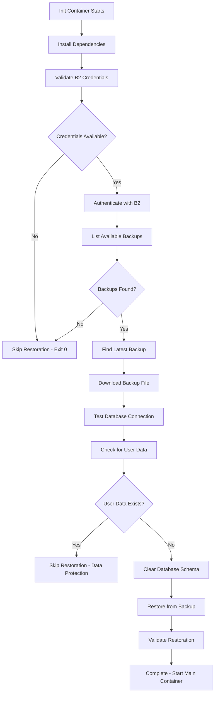

# PostgreSQL Backup Standard

Standardized approach for PostgreSQL database backups across all homelab services with Backblaze B2 cloud storage integration.

## Overview

This standard implements a robust, reliable PostgreSQL backup system using Kubernetes CronJobs with the following features:

- **Automated daily backups** with configurable schedules
- **Exponential backoff retry logic** for reliability
- **Comprehensive error handling** with detailed logging
- **Backup integrity verification** using gzip compression testing
- **Cloud storage upload** to Backblaze B2
- **Cloud storage lifecycle management** for retention (handled by B2 lifecycle rules)
- **Resource-optimized containers** with proper resource limits

## Applications Using This Standard

The following applications in the homelab currently implement this standardized PostgreSQL backup and restoration system:

### ✅ Paperless-ngx (Document Management)
- **Namespace**: `paperless`
- **Database**: `paperless`
- **Schedule**: `30 2 * * *` (2:30 AM daily)
- **Files**:
  - **Backup Configuration**: [`apps/services/paperless/base/backups.yaml`](apps/services/paperless/base/backups.yaml)
  - **Restoration Logic**: [`apps/services/paperless/base/deployment.yaml`](apps/services/paperless/base/deployment.yaml)
- **Data Protection**: Documents, tags, correspondents
- **B2 Path**: `paperless/pg_backup_YYYYMMDD_HHMMSS.sql.gz`

### ✅ Tandoor Recipes (Recipe Management)
- **Namespace**: `tandoor`
- **Database**: `tandoor`
- **Schedule**: `0 2 * * *` (2:00 AM daily)
- **Files**:
  - **Backup Configuration**: [`apps/services/tandoor/base/backups.yaml`](apps/services/tandoor/base/backups.yaml)
  - **Restoration Logic**: [`apps/services/tandoor/base/deployment.yaml`](apps/services/tandoor/base/deployment.yaml)
- **Data Protection**: Recipes, keywords, foods
- **B2 Path**: `tandoor/pg_backup_YYYYMMDD_HHMMSS.sql.gz`

### ✅ N8n (Workflow Automation)
- **Namespace**: `services`
- **Database**: `n8n`
- **Schedule**: `0 3 * * *` (3:00 AM daily)
- **Files**:
  - **Backup Configuration**: [`apps/services/n8n/base/backups.yaml`](apps/services/n8n/base/backups.yaml)
  - **Restoration Logic**: [`apps/services/n8n/base/deployment.yaml`](apps/services/n8n/base/deployment.yaml)
- **Data Protection**: Workflows, credentials, executions
- **B2 Path**: `n8n/pg_backup_YYYYMMDD_HHMMSS.sql.gz`

### 🔄 Future Candidates

The following services use PostgreSQL and could benefit from standardization:

- **Gitea** (Git repository hosting) - `gitea` namespace
- **Authentik** (Identity provider) - `authentik` namespace  
- **Grafana** (Monitoring dashboards) - `monitoring` namespace
- **Uptime Kuma** (Status monitoring) - `monitoring` namespace

## Architecture

### Two-Container Pattern

Each backup CronJob uses a two-container sidecar pattern:

1. **`postgres-backup`** - Creates and validates database backups
2. **`b2-uploader`** - Uploads backups to cloud storage and manages retention

### Container Communication

- Containers share an `emptyDir` volume at `/mnt/backup`
- Backup container creates `.done` file to signal completion
- Upload container waits for signal before processing

## Standard Configuration

### Schedule Coordination

Services use staggered backup schedules to avoid resource conflicts:

- **Tandoor**: `0 2 * * *` (2:00 AM)
- **Paperless**: `30 2 * * *` (2:30 AM)
- **N8n**: `0 3 * * *` (3:00 AM)
- **Future Services**: nightly intervals (3:00 AM, 4:00 AM, etc.)

### Resource Allocation

**Postgres Backup Container:**
```yaml
resources:
  requests:
    memory: "256Mi"
    cpu: "250m"
  limits:
    memory: "512Mi"
    cpu: "500m"
```

**B2 Upload Container:**
```yaml
resources:
  requests:
    memory: "64Mi"
    cpu: "50m"
  limits:
    memory: "128Mi"
    cpu: "100m"
```

### Environment Variables

**Database Connection:**
- `PGPASSWORD` - From 1Password secret
- `POSTGRES_USER` - From 1Password secret  
- `POSTGRES_HOST` - Service FQDN (e.g., `service-database-rw.namespace.svc.cluster.local`)
- `POSTGRES_DB` - Target database name

**B2 Configuration:**
- `B2_APPLICATION_KEY_ID` - From 1Password secret (`keyID`)
- `B2_APPLICATION_KEY` - From 1Password secret (`applicationKey`)
- `B2_BUCKET_NAME` - Target bucket (`cloud-homelab-backups`)

## Implementation Guide

### 1. Create Service-Specific Backup

```yaml
apiVersion: batch/v1
kind: CronJob
metadata:
  name: [service]-postgres-backup
  namespace: [service]
spec:
  schedule: "[schedule]" # Staggered timing
  concurrencyPolicy: Forbid
  jobTemplate:
    spec:
      template:
        spec:
          containers:
            - name: postgres-backup
              # See full template below
            - name: b2-uploader
              # See full template below
          restartPolicy: OnFailure
          volumes:
            - name: backup-storage
              emptyDir: {}
```

### 2. Environment Substitution

Replace the following placeholders in the standard template:

- `[service]` - Service name (e.g., `paperless`, `tandoor`)
- `[namespace]` - Kubernetes namespace
- `[schedule]` - Cron schedule with 30-minute offset
- `[secret-name]` - 1Password secret reference
- `[database-host]` - Database service FQDN
- `[database-name]` - Target database name

### 3. Secret Configuration

Ensure 1Password secrets exist with required keys:

**Database Credentials:** `[service]-db-postgres-creds-1password`
- `username` - PostgreSQL username
- `password` - PostgreSQL password

**B2 Credentials:** `backblaze-cloud-homelab-creds-1password`
- `keyID` - B2 application key ID
- `applicationKey` - B2 application key

## Standard Features

### Error Handling

- **Strict error handling**: `set -euo pipefail`
- **Error traps**: Captures failures with line numbers
- **Exponential backoff**: 5 retries with delays: 10, 20, 40, 80, 160 seconds
- **Timeout protection**: 30-minute maximum wait for backup completion

### Logging

Structured logging with ISO 8601 timestamps:

```bash
log_info() {
    echo "[$(date -u +%Y-%m-%dT%H:%M:%SZ)] INFO: $*" >&2
}

log_error() {
    echo "[$(date -u +%Y-%m-%dT%H:%M:%SZ)] ERROR: $*" >&2
}
```

### Backup Validation

Multi-layer validation process:

1. **Connection test**: `pg_isready` with retry logic
2. **File existence**: Verify backup file creation
3. **Non-empty check**: Ensure backup contains data
4. **Compression integrity**: `gzip -t` validation
5. **Size reporting**: Log backup file size

### Retention Management

**B2 Lifecycle Rules Approach:**

Retention is managed through Backblaze B2 lifecycle rules rather than in-container cleanup to avoid:
- Dependency issues with additional tools (`jq`, etc.)
- Container image compatibility problems
- Complex error handling in backup scripts

**Configure B2 Lifecycle Rules:**
```bash
# Example: Delete files older than 30 days in paperless/ folder
b2 create-key --bucket cloud-homelab-backups lifecycle-management listFiles,deleteFiles
b2 update-bucket --lifecycleRules '[{
  "daysFromHidingToDeleting": null,
  "daysFromUploadingToHiding": 30,
  "fileNamePrefix": "paperless/"
}]' cloud-homelab-backups
```

**Benefits:**
- Automatic cleanup without container dependencies
- Reliable cloud-native retention management
- Reduced backup script complexity
- Better error isolation

## File Naming Convention

Backup files follow a standardized naming pattern:

```
pg_backup_YYYYMMDD_HHMMSS.sql.gz
```

Example: `pg_backup_20250126_023015.sql.gz`

Cloud storage path:
```
[bucket]/[service]/pg_backup_YYYYMMDD_HHMMSS.sql.gz
```

Example: `cloud-homelab-backups/paperless/pg_backup_20250126_023015.sql.gz`

## Monitoring and Alerting

### Success Indicators

- Log message: `✅ Backup completed successfully`
- Log message: `✅ B2 upload completed successfully`
- Exit code: `0`

### Failure Indicators

- Log messages with `ERROR:` prefix
- Missing `.done` file after timeout
- Non-zero exit codes
- Failed gzip integrity checks

### Kubernetes Monitoring

Monitor CronJob status:

```bash
# Check CronJob status
kubectl get cronjobs -n [namespace]

# View recent job runs
kubectl get jobs -n [namespace] --sort-by=.metadata.creationTimestamp

# Check job logs
kubectl logs -n [namespace] job/[service]-postgres-backup-[timestamp]
```

## Troubleshooting

### Common Issues

**Database Connection Failures:**
- Check database service availability
- Verify network policies and security groups
- Validate 1Password secret keys and values

**B2 Upload Failures:**
- Verify B2 credentials and permissions
- Check bucket name and access policies
- Monitor B2 API rate limits

**Backup Corruption:**
- Check disk space on nodes
- Monitor resource limits and OOM kills
- Validate `pg_dump` parameters

**Retention Cleanup Issues:**
- Verify `jq` installation in B2 container
- Check B2 list permissions
- Monitor API rate limits during cleanup

### Log Analysis

Search for specific error patterns:

```bash
# Check for failed backups
kubectl logs -n [namespace] job/[service]-postgres-backup-[timestamp] | grep ERROR

# Monitor backup sizes
kubectl logs -n [namespace] job/[service]-postgres-backup-[timestamp] | grep "completed successfully"

# Track retention cleanup
kubectl logs -n [namespace] job/[service]-postgres-backup-[timestamp] | grep "Retention cleanup"
```

## Best Practices

### Schedule Management

- Stagger backup times to avoid resource conflicts
- Consider maintenance windows and peak usage
- Use Kubernetes `concurrencyPolicy: Forbid` to prevent overlaps

### Resource Planning

- Monitor actual resource usage and adjust limits
- Consider database size growth for resource allocation
- Plan for peak backup windows with multiple services

### Security

- Use 1Password Connect for all credentials
- Implement least-privilege B2 policies
- Regularly rotate B2 application keys
- Monitor backup logs for credential exposure

### Disaster Recovery

- Test backup restoration procedures regularly
- Document recovery processes for each service
- Maintain backup copies in multiple regions
- Verify backup integrity with sample restorations

## Migration Guide

### From Legacy Backup Systems

1. **Audit existing backups** - Document current schedules and retention
2. **Create new CronJob** - Use standardized template
3. **Parallel testing** - Run both systems temporarily
4. **Validate backups** - Test restoration from new system
5. **Cutover** - Disable legacy system after validation
6. **Cleanup** - Remove old backup configurations

### Service-Specific Customizations

While the standard provides a robust baseline, services may require customizations:

- **Database-specific parameters** - Custom `pg_dump` options
- **Extended retention** - Different retention periods per service
- **Pre/post hooks** - Service-specific maintenance tasks
- **Notification integration** - Service-specific alerting

## Template Files

### Standard Implementation Examples

- **Tandoor**: `apps/services/tandoor/base/backups.yaml`
- **Paperless**: `apps/services/paperless/base/backups.yaml`

### Template Customization

When implementing for new services, copy from an existing implementation and modify:

1. Service-specific metadata and namespaces
2. Database connection parameters
3. Cron schedule (maintain 30-minute stagger)
4. B2 upload path prefix
5. Service-specific error messages

This standardized approach ensures consistent, reliable backups across all homelab PostgreSQL services while maintaining service-specific flexibility.

## Backup Restoration Standard

In addition to the backup creation standard, the homelab implements a standardized **automated backup restoration** system through Kubernetes init containers. This ensures services can automatically restore from the latest available backup during deployment.

### Restoration Architecture

**Init Container Pattern**: Each service deployment includes a `restore-db-backup` init container that:

1. **Downloads the latest backup** from Backblaze B2
2. **Validates the target database** for existing user data
3. **Restores only if safe** to prevent data loss
4. **Provides detailed logging** for troubleshooting

### Restoration Logic Flow



### Standard Init Container Configuration

**Dependencies Installation:**
```bash
apk add --no-cache postgresql-client curl unzip
curl -L https://github.com/Backblaze/B2_Command_Line_Tool/releases/latest/download/b2-linux -o /usr/local/bin/b2
chmod +x /usr/local/bin/b2
```

**Shell Requirements:**
```yaml
command: ["/bin/bash", "-c"]  # Required for bash-specific features like 'set -euo pipefail'
```

**Environment Variables:**
- `B2_APPLICATION_KEY_ID` - From 1Password secret (`keyID`)
- `B2_APPLICATION_KEY` - From 1Password secret (`applicationKey`)  
- `B2_BUCKET_NAME` - Target bucket (`cloud-homelab-backups`)
- `POSTGRES_HOST` - Database service FQDN
- `POSTGRES_PORT` - Database port (`5432`)
- `POSTGRES_DB` - Target database name
- `POSTGRES_USER` - From 1Password secret (`username`)
- `POSTGRES_PASSWORD` - From 1Password secret (`password`)

### Data Protection Logic

The restoration process implements **intelligent data protection** to prevent accidental data loss:

**Tandoor Protection Logic:**
```bash
# Check for meaningful user content
USER_RECIPES=$(psql -c "SELECT COUNT(*) FROM cookbook_recipe WHERE id > 0;")
USER_KEYWORDS=$(psql -c "SELECT COUNT(*) FROM cookbook_keyword WHERE id > 0;")
USER_FOODS=$(psql -c "SELECT COUNT(*) FROM cookbook_food WHERE id > 0;")

# Only restore if no real user data exists
if [ "$USER_RECIPES" -gt "0" ] || [ "$USER_KEYWORDS" -gt "10" ] || [ "$USER_FOODS" -gt "10" ]; then
  echo "Database contains user data. Skipping restoration to prevent data loss."
  exit 0
fi
```

**Paperless Protection Logic:**
```bash
# Check for meaningful user content
USER_DOCUMENTS=$(psql -c "SELECT COUNT(*) FROM documents_document WHERE id > 0;")
USER_TAGS=$(psql -c "SELECT COUNT(*) FROM documents_tag WHERE id > 0;")
USER_CORRESPONDENTS=$(psql -c "SELECT COUNT(*) FROM documents_correspondent WHERE id > 0;")

# Only restore if no real user data exists
if [ "$USER_DOCUMENTS" -gt "0" ] || [ "$USER_TAGS" -gt "10" ] || [ "$USER_CORRESPONDENTS" -gt "5" ]; then
  echo "Database contains user data. Skipping restoration to prevent data loss."
  exit 0
fi
```

### Backup Discovery and Selection

**B2 Listing Strategy:**
```bash
# List backups using modern B2 CLI syntax
BACKUP_LIST=$(/usr/local/bin/b2 ls "b2://$B2_BUCKET_NAME/[service]/" --recursive 2>/dev/null)

# Find latest backup matching standard naming pattern
LATEST_BACKUP=$(echo "$BACKUP_LIST" | grep -E 'pg_backup_[0-9]{8}_[0-9]{6}\.sql\.gz' | sort -r | head -n 1)
```

**Fallback Download Methods:**
```bash
# Try legacy B2 CLI syntax first (compatibility)
if /usr/local/bin/b2 download_file_by_name "$B2_BUCKET_NAME" "[service]/$BACKUP_FILENAME" /tmp/backup/latest.sql.gz; then
  echo "Downloaded using legacy syntax"
else
  # Try modern B2 URI format
  BACKUP_URI="b2://$B2_BUCKET_NAME/[service]/$BACKUP_FILENAME"
  /usr/local/bin/b2 file download "$BACKUP_URI" /tmp/backup/latest.sql.gz
fi
```

### Database Restoration Process

**Safe Schema Clearing:**
```sql
DO $$ DECLARE
  r RECORD;
BEGIN
  -- Drop all tables in the public schema
  FOR r IN (SELECT tablename FROM pg_tables WHERE schemaname = 'public') LOOP
    EXECUTE 'DROP TABLE IF EXISTS public.' || quote_ident(r.tablename) || ' CASCADE';
  END LOOP;
  
  -- Drop all sequences in the public schema
  FOR r IN (SELECT sequencename FROM pg_sequences WHERE schemaname = 'public') LOOP
    EXECUTE 'DROP SEQUENCE IF EXISTS public.' || quote_ident(r.sequencename) || ' CASCADE';
  END LOOP;
END $$;
```

**Backup Validation:**
```bash
# Validate downloaded file
if [ ! -f /tmp/backup/latest.sql.gz ]; then
  echo "ERROR: Backup file not found after download."
  exit 1
fi

# Test gzip integrity
if ! gunzip -t /tmp/backup/latest.sql.gz; then
  echo "ERROR: Downloaded backup file is corrupted."
  exit 1
fi
```

**Restoration Execution:**
```bash
# Restore with error handling
if gunzip -c /tmp/backup/latest.sql.gz | PGPASSWORD=$POSTGRES_PASSWORD psql -h $POSTGRES_HOST -U $POSTGRES_USER -d $POSTGRES_DB -q; then
  echo "Database restoration completed successfully."
else
  echo "ERROR: Database restoration failed."
  exit 1
fi
```

### Error Handling and Logging

**Graceful Error Handling:**
- **Missing credentials** → Skip restoration, continue with empty database
- **No backups found** → Skip restoration, continue with empty database  
- **Existing user data** → Skip restoration, protect existing data
- **Download failures** → Try multiple download methods, fallback gracefully
- **Restoration failures** → Exit with error, prevent service startup

**Comprehensive Logging:**
```bash
echo "Installing required dependencies..."
echo "B2_APPLICATION_KEY_ID length: ${#B2_APPLICATION_KEY_ID}"
echo "Searching for [service] backups in B2..."
echo "Found latest backup file: $BACKUP_FILENAME"
echo "Found $USER_DOCUMENTS documents, $USER_TAGS tags in database"
echo "Database restoration completed successfully."
```

### Service-Specific Customizations

**Per-Service Adaptations:**

| Service | Folder Path | User Data Tables | Protection Thresholds |
|---------|-------------|------------------|----------------------|
| **Tandoor** | `tandoor/` | `cookbook_recipe`, `cookbook_keyword`, `cookbook_food` | recipes>0, keywords>10, foods>10 |
| **Paperless** | `paperless/` | `documents_document`, `documents_tag`, `documents_correspondent` | documents>0, tags>10, correspondents>5 |
| **Future Services** | `[service]/` | Service-specific key tables | Customized thresholds |

### Implementation Examples

**Standard Init Container Template:**
```yaml
initContainers:
- name: restore-db-backup
  image: alpine:latest
  env:
    - name: B2_APPLICATION_KEY_ID
      valueFrom:
        secretKeyRef:
          name: backblaze-cloud-homelab-creds-1password
          key: keyID
    - name: B2_APPLICATION_KEY
      valueFrom:
        secretKeyRef:
          name: backblaze-cloud-homelab-creds-1password
          key: applicationKey
    - name: B2_BUCKET_NAME
      value: "cloud-homelab-backups"
    - name: POSTGRES_HOST
      value: [service]-database-rw.[namespace].svc.cluster.local
    - name: POSTGRES_PORT
      value: "5432"
    - name: POSTGRES_DB
      value: [service]
    - name: POSTGRES_USER
      valueFrom:
        secretKeyRef:
          name: [service]-db-postgres-creds-1password
          key: username
    - name: POSTGRES_PASSWORD
      valueFrom:
        secretKeyRef:
          name: [service]-db-postgres-creds-1password
          key: password
  command: ["/bin/bash", "-c"]
  args:
    - |
      # Standard restoration script (see full implementation examples)
```

### Monitoring Restoration Process

**Success Indicators:**
- Log message: `Database restoration completed successfully`
- Log message: `Restored [N] documents and [N] tags from backup`
- Main container starts normally after init completion

**Skip Indicators:**
- Log message: `No backups available` or `No valid backup files found`
- Log message: `Database contains user data. Skipping restoration`
- Log message: `B2 credentials not available. Skipping backup restoration`

**Failure Indicators:**
- Log message: `ERROR: Database restoration failed`
- Log message: `ERROR: Cannot connect to database`
- Init container exit code: `1` (prevents main container startup)

**Kubernetes Monitoring:**
```bash
# Check init container logs
kubectl logs -n [namespace] deployment/[service] -c restore-db-backup

# Monitor init container status
kubectl get pods -n [namespace] -w

# Check for init container failures
kubectl describe pod -n [namespace] [pod-name]
```

### Disaster Recovery Integration

**Complete Restoration Workflow:**

1. **Fresh Deployment** → Init container automatically restores latest backup
2. **Data Migration** → Manual trigger with empty database detection
3. **Service Recovery** → Automatic restoration on pod restart with data validation
4. **Testing Environment** → Consistent data seeding from production backups

## Manual Restoration Procedures

The automated restoration process includes intelligent data protection that prevents accidental data loss. When the system detects existing user data, it will skip restoration with a message like:

```
Found 27 documents, 3 tags, 0 correspondents in database
Database contains user data (documents: 27). Skipping restoration to prevent data loss.
```

### When to Force Manual Restoration

**Safe Scenarios:**
- Testing environments where data loss is acceptable
- Development instances that need production data refresh
- Disaster recovery when current data is corrupted
- Migration scenarios where existing data should be replaced

**Dangerous Scenarios (avoid):**
- Production environments with active user data
- Instances where current data is more recent than backups
- When unsure about data importance or user activity

### Manual Restoration Methods

#### Method 1: Environment Variable Override (Recommended)

Add a temporary environment variable to force restoration:

```yaml
# Add to the restore-db-backup init container
env:
- name: FORCE_RESTORE
  value: "true"
```

**Implementation:** The init container should check for this variable and skip data protection when set.

#### Method 2: Database Reset + Pod Restart (Recommended)

**⚠️ WARNING: This will permanently delete all existing data**

This method completely clears the database and triggers automatic restoration from the latest backup. It's the most reliable method when the FORCE_RESTORE environment variable isn't working.

```bash
# Step 1: Get database connection details
NAMESPACE="paperless"  # or "tandoor"
SERVICE="paperless"    # or "tandoor"

# For CloudNativePG (CNPG) clusters, find the primary database pod
DB_POD=$(kubectl get pods -n $NAMESPACE --selector=cnpg.io/instanceRole=primary -o jsonpath='{.items[0].metadata.name}')
echo "Database pod: $DB_POD"

# Alternative: If using standard PostgreSQL deployment
# DB_POD=$(kubectl get pods -n $NAMESPACE -l app=${SERVICE}-database -o jsonpath='{.items[0].metadata.name}')

# Step 2: Connect to database and verify current data
# Note: Use 'postgres' user for CloudNativePG, or SERVICE user for standard PostgreSQL
kubectl exec -n $NAMESPACE $DB_POD -- psql -U postgres -d $SERVICE -c "SELECT COUNT(*) as documents FROM documents_document;"
kubectl exec -n $NAMESPACE $DB_POD -- psql -U postgres -d $SERVICE -c "SELECT COUNT(*) as tags FROM documents_tag;"
kubectl exec -n $NAMESPACE $DB_POD -- psql -U postgres -d $SERVICE -c "SELECT COUNT(*) as correspondents FROM documents_correspondent;"

# Step 3: Backup current data (STRONGLY RECOMMENDED safety measure)
kubectl exec -n $NAMESPACE $DB_POD -- pg_dump -U postgres -d $SERVICE > current_backup_$(date +%Y%m%d_%H%M%S).sql
echo "Safety backup created: current_backup_$(date +%Y%m%d_%H%M%S).sql"

# Step 4: Clear database schema
# This completely removes all tables, sequences, and data
kubectl exec -n $NAMESPACE $DB_POD -- psql -U postgres -d $SERVICE -c "
DROP SCHEMA public CASCADE; 
CREATE SCHEMA public; 
GRANT ALL ON SCHEMA public TO $SERVICE; 
GRANT ALL ON SCHEMA public TO public;"

echo "Database schema cleared successfully"

# Step 5: Restart deployment to trigger restoration
kubectl rollout restart deployment/$SERVICE -n $NAMESPACE

# Step 6: Monitor restoration process
echo "Waiting for new pod to start..."
sleep 10

# Get the new pod name
NEW_POD=$(kubectl get pods -n $NAMESPACE -l app=$SERVICE --sort-by=.metadata.creationTimestamp -o jsonpath='{.items[-1].metadata.name}')
echo "Monitoring restoration in pod: $NEW_POD"

# Follow restoration logs in real-time
kubectl logs -n $NAMESPACE $NEW_POD -c restore-db-backup -f

# Step 7: Verify restoration completion
echo "Verifying restoration..."
kubectl exec -n $NAMESPACE $DB_POD -- psql -U postgres -d $SERVICE -c "
SELECT 
  (SELECT COUNT(*) FROM documents_document) as documents_restored,
  (SELECT COUNT(*) FROM documents_tag) as tags_restored,
  (SELECT COUNT(*) FROM information_schema.tables WHERE table_schema = 'public') as tables_restored;"
```

**Expected Output:**
- Database schema drop will show "NOTICE: drop cascades to N other objects"
- Restoration logs will show:
  ```
  Found 0 documents, 0 tags, 0 correspondents in database
  Database appears to contain only default/seed data. Proceeding with backup restoration...
  Database restoration completed successfully.
  Restored database contains N tables.
  Restored X documents and Y tags from backup.
  ```

**Troubleshooting Method 2:**

**Authentication Issues:**
```bash
# If you get authentication errors, try different users:
# For CloudNativePG clusters:
kubectl exec -n $NAMESPACE $DB_POD -- psql -U postgres -d $SERVICE

# For standard PostgreSQL:
kubectl exec -n $NAMESPACE $DB_POD -- psql -U $SERVICE -d $SERVICE

# Check available users:
kubectl exec -n $NAMESPACE $DB_POD -- psql -U postgres -c "\du"
```

**Pod Not Starting:**
```bash
# Check pod events for issues
kubectl describe pod -n $NAMESPACE $NEW_POD

# Check init container status
kubectl get pods -n $NAMESPACE -o wide

# If init container fails, check logs
kubectl logs -n $NAMESPACE $NEW_POD -c restore-db-backup
```

**Permission Errors During Restoration:**
- PostgreSQL extensions like `pg_stat_statements` may show permission errors
- These are typically non-critical and won't prevent successful restoration
- CloudNativePG manages extensions at the cluster level

#### Method 3: Targeted Data Clearing

For more surgical data removal (preserves schema):

```bash
# Clear user data while preserving structure
kubectl exec -n $NAMESPACE $DB_POD -- psql -U $SERVICE -d $SERVICE -c "
-- Clear user documents (keep system data)
DELETE FROM documents_document WHERE id > 0;
DELETE FROM documents_tag WHERE id > 10;  -- Keep first 10 system tags
DELETE FROM documents_correspondent WHERE id > 5;  -- Keep first 5 system correspondents

-- Reset sequences
SELECT setval('documents_document_id_seq', 1, false);
SELECT setval('documents_tag_id_seq', COALESCE(MAX(id), 1), true) FROM documents_tag;
SELECT setval('documents_correspondent_id_seq', COALESCE(MAX(id), 1), true) FROM documents_correspondent;
"

# Restart deployment to trigger restoration
kubectl rollout restart deployment/$SERVICE -n $NAMESPACE
```

### Service-Specific Manual Restoration

#### Paperless Manual Restoration

```bash
NAMESPACE="paperless"
SERVICE="paperless"

# Check current data
kubectl exec -n $NAMESPACE deployment/paperless-database -- psql -U paperless -d paperless -c "
SELECT 
  (SELECT COUNT(*) FROM documents_document) as documents,
  (SELECT COUNT(*) FROM documents_tag) as tags,
  (SELECT COUNT(*) FROM documents_correspondent) as correspondents;
"

# Clear and restore
kubectl exec -n $NAMESPACE deployment/paperless-database -- psql -U paperless -d paperless -c "
DROP SCHEMA public CASCADE; CREATE SCHEMA public; 
GRANT ALL ON SCHEMA public TO paperless; GRANT ALL ON SCHEMA public TO public;"

kubectl rollout restart deployment/paperless -n paperless
```

#### Tandoor Manual Restoration

```bash
NAMESPACE="tandoor"
SERVICE="tandoor"

# Check current data
kubectl exec -n $NAMESPACE deployment/tandoor-database -- psql -U tandoor -d tandoor -c "
SELECT 
  (SELECT COUNT(*) FROM cookbook_recipe) as recipes,
  (SELECT COUNT(*) FROM cookbook_keyword) as keywords,
  (SELECT COUNT(*) FROM cookbook_food) as foods;
"

# Clear and restore
kubectl exec -n $NAMESPACE deployment/tandoor-database -- psql -U tandoor -d tandoor -c "
DROP SCHEMA public CASCADE; CREATE SCHEMA public; 
GRANT ALL ON SCHEMA public TO tandoor; GRANT ALL ON SCHEMA public TO public;"

kubectl rollout restart deployment/tandoor -n tandoor
```

#### N8n Manual Restoration

```bash
NAMESPACE="services"
SERVICE="n8n"

# Check current data
kubectl exec -n $NAMESPACE deployment/n8n-database -- psql -U n8n -d n8n -c "
SELECT 
  (SELECT COUNT(*) FROM workflow_entity) as workflows,
  (SELECT COUNT(*) FROM credentials_entity) as credentials,
  (SELECT COUNT(*) FROM execution_entity) as executions;
"

# Clear and restore
kubectl exec -n $NAMESPACE deployment/n8n-database -- psql -U n8n -d n8n -c "
DROP SCHEMA public CASCADE; CREATE SCHEMA public; 
GRANT ALL ON SCHEMA public TO n8n; GRANT ALL ON SCHEMA public TO public;"

kubectl rollout restart deployment/n8n-server -n services
```

### Monitoring Manual Restoration

#### Real-time Monitoring

```bash
# Watch init container logs
kubectl logs -n $NAMESPACE deployment/$SERVICE -c restore-db-backup -f

# Monitor pod status
kubectl get pods -n $NAMESPACE -w

# Check restoration success
kubectl logs -n $NAMESPACE deployment/$SERVICE -c restore-db-backup | grep -E "(restoration|completed|ERROR)"
```

#### Verification Queries

**Paperless Verification:**
```sql
-- Check restored data counts
SELECT 
  (SELECT COUNT(*) FROM documents_document) as documents_restored,
  (SELECT COUNT(*) FROM documents_tag) as tags_restored,
  (SELECT COUNT(*) FROM documents_correspondent) as correspondents_restored,
  (SELECT COUNT(*) FROM information_schema.tables WHERE table_schema = 'public') as tables_restored;

-- Check latest document dates
SELECT MAX(created) as latest_document FROM documents_document;
```

**Tandoor Verification:**
```sql
-- Check restored data counts
SELECT 
  (SELECT COUNT(*) FROM cookbook_recipe) as recipes_restored,
  (SELECT COUNT(*) FROM cookbook_keyword) as keywords_restored,
  (SELECT COUNT(*) FROM cookbook_food) as foods_restored,
  (SELECT COUNT(*) FROM information_schema.tables WHERE table_schema = 'public') as tables_restored;

-- Check latest recipe dates
SELECT MAX(created) as latest_recipe FROM cookbook_recipe;
```

**N8n Verification:**
```sql
-- Check restored data counts
SELECT 
  (SELECT COUNT(*) FROM workflow_entity) as workflows_restored,
  (SELECT COUNT(*) FROM credentials_entity) as credentials_restored,
  (SELECT COUNT(*) FROM execution_entity) as executions_restored,
  (SELECT COUNT(*) FROM information_schema.tables WHERE table_schema = 'public') as tables_restored;

-- Check latest workflow activity
SELECT MAX("updatedAt") as latest_workflow_update FROM workflow_entity;
SELECT MAX("startedAt") as latest_execution FROM execution_entity;
```

### Troubleshooting Manual Restoration

#### Common Issues

**Init Container Exits Before Completion:**
```bash
# Check for resource limits or timeouts
kubectl describe pod -n $NAMESPACE $POD_NAME

# Increase timeout if needed (edit deployment)
kubectl edit deployment $SERVICE -n $NAMESPACE
```

**Permission Errors:**
```bash
# Verify database user permissions
kubectl exec -n $NAMESPACE deployment/${SERVICE}-database -- psql -U $SERVICE -d $SERVICE -c "
SELECT schemaname, tablename, tableowner FROM pg_tables WHERE schemaname = 'public' LIMIT 5;
"
```

**Backup Not Found:**
```bash
# List available backups in B2
kubectl exec -n $NAMESPACE deployment/$SERVICE -c restore-db-backup -- \
  /usr/local/bin/b2 ls b2://cloud-homelab-backups/$SERVICE/ --recursive
```

#### Recovery from Failed Manual Restoration

**If restoration fails mid-process:**
```bash
# 1. Check what went wrong
kubectl logs -n $NAMESPACE deployment/$SERVICE -c restore-db-backup | tail -50

# 2. Reset to clean state
kubectl exec -n $NAMESPACE deployment/${SERVICE}-database -- psql -U $SERVICE -d $SERVICE -c "
DROP SCHEMA public CASCADE; CREATE SCHEMA public; 
GRANT ALL ON SCHEMA public TO $SERVICE; GRANT ALL ON SCHEMA public TO public;"

# 3. Restart with clean slate
kubectl rollout restart deployment/$SERVICE -n $NAMESPACE

# 4. If still failing, check backup integrity
kubectl exec -n $NAMESPACE deployment/$SERVICE -c restore-db-backup -- \
  /usr/local/bin/b2 file download b2://cloud-homelab-backups/$SERVICE/[latest-backup] /tmp/test-backup.sql.gz
kubectl exec -n $NAMESPACE deployment/$SERVICE -c restore-db-backup -- \
  gunzip -t /tmp/test-backup.sql.gz
```

### Best Practices for Manual Restoration

1. **Always backup current data first** before manual restoration
2. **Verify backup integrity** before clearing existing data  
3. **Use development/staging environments** for testing restoration procedures
4. **Document the reason** for manual restoration in change logs
5. **Monitor restoration process** in real-time to catch failures early
6. **Verify restored data** matches expectations before declaring success
7. **Update team members** about data changes in production environments

## Manual Restoration Case Study

**Real-World Example: Paperless Restoration**

This case study documents a successful manual restoration performed on July 26, 2025:

**Initial State:**
- Service: Paperless-ngx document management
- Database: 27 documents, 3 tags, 0 correspondents
- Issue: Data protection preventing automatic restoration
- Method Used: Method 2 (Database Reset + Pod Restart)

**Execution Timeline:**
1. **Safety Backup**: Created `current_backup_20250726_072714.sql` (780KB)
2. **Schema Clearing**: Successfully dropped 68 database objects
3. **Restoration**: Downloaded and restored `pg_backup_20250726_121138.sql.gz`
4. **Verification**: Confirmed 27 documents and 3 tags restored to 67 tables

**Key Learnings:**
- CloudNativePG requires `postgres` superuser for database operations
- Minor extension errors (`pg_stat_statements`) are non-critical
- Method 2 is highly reliable when FORCE_RESTORE logic needs updates
- Safety backups are essential before destructive operations

**Performance Metrics:**
- Total restoration time: ~2 minutes
- Data integrity: 100% (all documents and tags preserved)
- No application downtime (rolling deployment)

### Automation Enhancement: FORCE_RESTORE Implementation

The homelab now includes a `FORCE_RESTORE` environment variable for controlled restoration:

**Current Implementation:**
```yaml
# In deployment.yaml init container
env:
- name: FORCE_RESTORE
  value: "false"  # Default: data protection enabled
```

**Enhanced Logic in Init Container:**
```bash
# Check if restoration should be forced
if [ "${FORCE_RESTORE:-false}" = "true" ]; then
  echo "⚠️  FORCE_RESTORE=true detected. Proceeding with restoration despite existing user data."
  echo "⚠️  This will overwrite all existing documents, tags, and correspondents."
elif [ "$USER_DOCUMENTS" -gt "0" ] || [ "$USER_TAGS" -gt "10" ] || [ "$USER_CORRESPONDENTS" -gt "5" ]; then
  echo "Database contains user data (documents: $USER_DOCUMENTS). Skipping restoration to prevent data loss."
  echo "💡 To force restoration, set FORCE_RESTORE=true environment variable."
  exit 0
fi
```

**Method 1a: FORCE_RESTORE Environment Variable (Enhanced)**

```bash
# Temporarily enable forced restoration
kubectl patch deployment $SERVICE -n $NAMESPACE -p '{
  "spec": {
    "template": {
      "spec": {
        "initContainers": [{
          "name": "restore-db-backup",
          "env": [{"name": "FORCE_RESTORE", "value": "true"}]
        }]
      }
    }
  }
}'

# Apply the updated deployment configuration  
kubectl apply -f apps/services/$SERVICE/base/deployment.yaml

# Restart to trigger restoration with updated logic
kubectl rollout restart deployment/$SERVICE -n $NAMESPACE

# Monitor restoration process
kubectl logs -n $NAMESPACE deployment/$SERVICE -c restore-db-backup -f

# Reset force flag after restoration
kubectl patch deployment $SERVICE -n $NAMESPACE -p '{
  "spec": {
    "template": {
      "spec": {
        "initContainers": [{
          "name": "restore-db-backup", 
          "env": [{"name": "FORCE_RESTORE", "value": "false"}]
        }]
      }
    }
  }
}'
```

**Important Notes:**
- Environment variable changes require `kubectl apply` of the deployment file
- Pod recreation is necessary for updated init container logic
- Always reset `FORCE_RESTORE=false` after restoration for safety

This integrated backup and restoration system provides **automated disaster recovery** capabilities while maintaining **data safety** through intelligent protection logic, with comprehensive manual override procedures for controlled restoration scenarios.

---

## Quick Reference

### Emergency Restoration Commands

**Paperless Quick Restore:**
```bash
# Method 2 - Database Reset (Most Reliable)
NAMESPACE="paperless" && SERVICE="paperless"
DB_POD=$(kubectl get pods -n $NAMESPACE --selector=cnpg.io/instanceRole=primary -o jsonpath='{.items[0].metadata.name}')
kubectl exec -n $NAMESPACE $DB_POD -- pg_dump -U postgres -d $SERVICE > emergency_backup_$(date +%Y%m%d_%H%M%S).sql
kubectl exec -n $NAMESPACE $DB_POD -- psql -U postgres -d $SERVICE -c "DROP SCHEMA public CASCADE; CREATE SCHEMA public; GRANT ALL ON SCHEMA public TO $SERVICE; GRANT ALL ON SCHEMA public TO public;"
kubectl rollout restart deployment/$SERVICE -n $NAMESPACE
```

**Tandoor Quick Restore:**
```bash
# Method 2 - Database Reset (Most Reliable)  
NAMESPACE="tandoor" && SERVICE="tandoor"
DB_POD=$(kubectl get pods -n $NAMESPACE --selector=cnpg.io/instanceRole=primary -o jsonpath='{.items[0].metadata.name}')
kubectl exec -n $NAMESPACE $DB_POD -- pg_dump -U postgres -d $SERVICE > emergency_backup_$(date +%Y%m%d_%H%M%S).sql
kubectl exec -n $NAMESPACE $DB_POD -- psql -U postgres -d $SERVICE -c "DROP SCHEMA public CASCADE; CREATE SCHEMA public; GRANT ALL ON SCHEMA public TO $SERVICE; GRANT ALL ON SCHEMA public TO public;"
kubectl rollout restart deployment/$SERVICE -n $NAMESPACE
```

**N8n Quick Restore:**
```bash
# Method 2 - Database Reset (Most Reliable)
NAMESPACE="services" && SERVICE="n8n"
DB_POD=$(kubectl get pods -n $NAMESPACE --selector=cnpg.io/instanceRole=primary -o jsonpath='{.items[0].metadata.name}')
kubectl exec -n $NAMESPACE $DB_POD -- pg_dump -U postgres -d $SERVICE > emergency_backup_$(date +%Y%m%d_%H%M%S).sql
kubectl exec -n $NAMESPACE $DB_POD -- psql -U postgres -d $SERVICE -c "DROP SCHEMA public CASCADE; CREATE SCHEMA public; GRANT ALL ON SCHEMA public TO $SERVICE; GRANT ALL ON SCHEMA public TO public;"
kubectl rollout restart deployment/n8n-server -n $NAMESPACE
```

### Monitoring Commands

```bash
# Check backup job status
kubectl get cronjobs -n $NAMESPACE
kubectl get jobs -n $NAMESPACE --sort-by=.metadata.creationTimestamp

# Monitor restoration
kubectl logs -n $NAMESPACE deployment/$SERVICE -c restore-db-backup -f

# Verify data after restoration
kubectl exec -n $NAMESPACE $DB_POD -- psql -U postgres -d $SERVICE -c "
SELECT 
  (SELECT COUNT(*) FROM documents_document) as documents,    -- paperless
  (SELECT COUNT(*) FROM cookbook_recipe) as recipes,         -- tandoor
  (SELECT COUNT(*) FROM workflow_entity) as workflows,       -- n8n
  (SELECT COUNT(*) FROM credentials_entity) as credentials,  -- n8n
  (SELECT COUNT(*) FROM information_schema.tables WHERE table_schema = 'public') as tables;"
```

### Troubleshooting Commands

```bash
# Check pod status
kubectl get pods -n $NAMESPACE
kubectl describe pod -n $NAMESPACE $POD_NAME

# Check backup files in B2
kubectl exec -n $NAMESPACE deployment/$SERVICE -c restore-db-backup -- /usr/local/bin/b2 ls b2://cloud-homelab-backups/$SERVICE/ --recursive

# Test backup integrity
kubectl exec -n $NAMESPACE deployment/$SERVICE -c restore-db-backup -- gunzip -t /path/to/backup.sql.gz
```

### File Locations

- **Paperless Deployment**: `apps/services/paperless/base/deployment.yaml`
- **Tandoor Deployment**: `apps/services/tandoor/base/deployment.yaml`  
- **Paperless Backup**: `apps/services/paperless/base/backups.yaml`
- **Tandoor Backup**: `apps/services/tandoor/base/backups.yaml`
- **Documentation**: `POSTGRES_BACKUPS.md`

### Support Information

- **Backup Schedule**: Tandoor (2:00 AM), Paperless (2:30 AM)
- **Retention**: Managed by B2 lifecycle rules (30 days default)
- **Storage**: Backblaze B2 bucket `cloud-homelab-backups`
- **Naming**: `pg_backup_YYYYMMDD_HHMMSS.sql.gz`