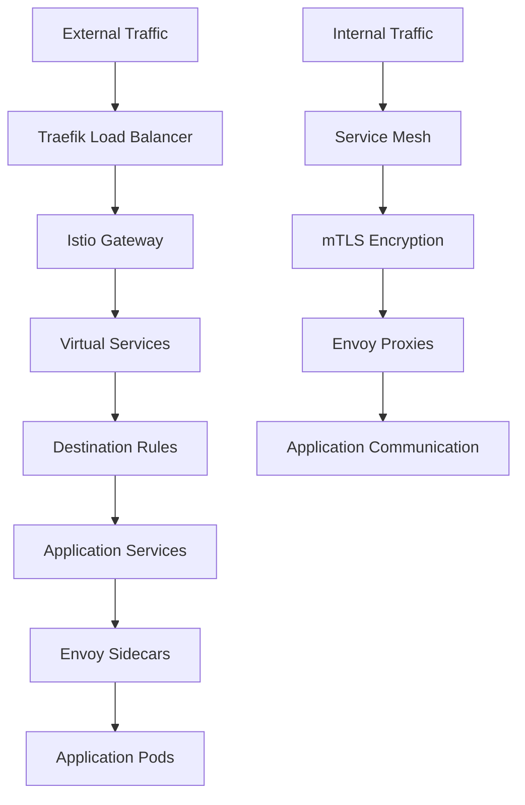

# Homelab Kubernetes Architecture Blueprint

## Executive Summary

This blueprint outlines the comprehensive cloud-native architecture for the homelab Kubernetes cluster, synthesizing scout findings with strategic architectural improvements focused on service mesh integration, enhanced observability, disaster recovery, and high availability patterns.

## Current Architecture Assessment

### 🎯 Strengths (Based on Scout Analysis)
- **Solid GitOps Foundation**: ArgoCD-based deployment with declarative configurations
- **Modern CNI**: Cilium with Envoy proxy and host firewall capabilities
- **Comprehensive Monitoring**: Prometheus/Grafana stack with multiple exporters
- **Secure Secrets Management**: 1Password integration for credential handling
- **Infrastructure as Code**: Crossplane for infrastructure provisioning
- **Production-Ready Ingress**: Traefik with SSL termination and LoadBalancer setup
- **Automated Backup Strategy**: Backblaze B2 integration with restore capabilities

### ⚠️ Architecture Gaps (Scout Identified)
- **No Service Mesh**: Missing traffic encryption, observability, and policy enforcement
- **Limited Observability**: No distributed tracing or advanced traffic analysis
- **Basic Security Posture**: Lacking zero-trust networking and pod security standards
- **Manual Scaling**: No horizontal pod autoscaling or vertical scaling automation
- **Single-Point Failures**: Missing HA patterns for critical components

## Architectural Improvement Strategy

### Phase 1: Service Mesh Integration (Priority: HIGH)
```yaml
Service Mesh Implementation:
  Primary: Istio Service Mesh
  Components:
    - Istio Control Plane
    - Envoy Proxy Sidecars
    - Jaeger Distributed Tracing
    - Kiali Service Graph Visualization
  Benefits:
    - mTLS encryption for all pod-to-pod communication
    - Advanced traffic management and canary deployments
    - Comprehensive observability with distributed tracing
    - Zero-trust security model
```

### Phase 2: Enhanced Observability Stack (Priority: HIGH)
```yaml
Observability Enhancements:
  Distributed Tracing:
    - Jaeger for request tracing
    - OpenTelemetry for metrics collection
    - Zipkin as backup tracing solution
  Advanced Monitoring:
    - Thanos for long-term Prometheus storage
    - AlertManager with multi-channel notifications
    - Grafana enhancement with service mesh dashboards
  Log Aggregation:
    - Loki for centralized logging
    - Fluent Bit for log collection
    - Grafana integration for unified observability
```

### Phase 3: Security Hardening (Priority: HIGH)
```yaml
Security Architecture:
  Zero-Trust Networking:
    - Istio authorization policies
    - Network policies with Cilium
    - Pod Security Standards enforcement
  Security Scanning:
    - Falco for runtime security monitoring
    - Trivy for vulnerability scanning
    - OPA Gatekeeper for policy enforcement
  Identity Management:
    - SPIFFE/SPIRE for workload identity
    - External-secrets operator integration
    - RBAC fine-tuning
```

### Phase 4: High Availability & Disaster Recovery (Priority: MEDIUM)
```yaml
HA Architecture:
  Multi-Zone Deployment:
    - Pod anti-affinity rules
    - Zone-aware storage classes
    - Cross-zone load balancing
  Disaster Recovery:
    - Velero for cluster backup/restore
    - Database replication strategies
    - Infrastructure as Code versioning
  Backup Strategy:
    - Automated etcd backups
    - Application data backup automation
    - Cross-cloud backup replication
```

### Phase 5: Automation & Scaling (Priority: MEDIUM)
```yaml
Automation Enhancements:
  Auto-Scaling:
    - Horizontal Pod Autoscaler (HPA) with custom metrics
    - Vertical Pod Autoscaler (VPA) for resource optimization
    - Cluster Autoscaler for node management
  Policy Automation:
    - OPA Gatekeeper for admission control
    - Automated certificate management
    - Resource quota enforcement
```

## Implementation Roadmap

### Quarter 1: Foundation Enhancement
**Week 1-2: Service Mesh Preparation**
- Install Istio with minimal configuration
- Enable sidecar injection for select namespaces
- Configure basic traffic management

**Week 3-4: Observability Integration**
- Deploy Jaeger for distributed tracing
- Integrate with existing Prometheus/Grafana
- Add service mesh metrics dashboards

### Quarter 2: Security & Reliability
**Week 1-2: Security Hardening**
- Implement pod security standards
- Deploy Falco for runtime monitoring
- Configure network policies

**Week 3-4: Backup & Recovery**
- Implement Velero cluster backups
- Test disaster recovery procedures
- Automate backup validation

### Quarter 3: Advanced Features
**Week 1-2: Auto-scaling Implementation**
- Deploy HPA with custom metrics
- Implement VPA for resource optimization
- Test scaling policies

**Week 3-4: Policy Enforcement**
- Deploy OPA Gatekeeper
- Implement admission controllers
- Automate compliance checking

### Quarter 4: Optimization & Monitoring
**Week 1-2: Performance Optimization**
- Tune service mesh performance
- Optimize resource allocation
- Implement advanced monitoring

**Week 3-4: Documentation & Training**
- Complete architectural documentation
- Create operational runbooks
- Conduct knowledge transfer

## Technology Stack Evolution

### Current Stack Analysis
```yaml
Networking:
  CNI: Cilium ✅ (Modern, eBPF-based)
  Ingress: Traefik ✅ (Production-ready)
  Load Balancer: MetalLB ✅ (Bare-metal appropriate)
  
Monitoring:
  Metrics: Prometheus ✅ (Industry standard)
  Visualization: Grafana ✅ (Comprehensive)
  Gaps: Distributed tracing, advanced alerting
  
Security:
  Secrets: 1Password ✅ (Secure external)
  Gaps: Runtime security, policy enforcement
  
Storage:
  CSI: Democratic CSI ✅ (NFS integration)
  Backup: Backblaze B2 ✅ (Cost-effective)
```

### Proposed Stack Additions
```yaml
Service Mesh:
  Control Plane: Istio
  Data Plane: Envoy (already in Cilium)
  Observability: Jaeger + Kiali
  
Enhanced Security:
  Runtime: Falco
  Policy: OPA Gatekeeper
  Scanning: Trivy
  
Advanced Monitoring:
  Long-term Storage: Thanos
  Log Aggregation: Loki + Fluent Bit
  Alerting: AlertManager (enhanced)
```

## Service Mesh Architecture Design

### Istio Integration Strategy
```yaml
Deployment Model:
  Installation: Minimal profile with gradual expansion
  Namespace Strategy: Selective sidecar injection
  Traffic Management:
    - East-West: mTLS for all pod communication
    - North-South: Gateway configuration with Traefik
  
Integration Points:
  Existing Cilium: Dual CNI configuration
  Existing Monitoring: Prometheus federation
  Existing Ingress: Gateway API compatibility
```

### Traffic Flow Design


## Observability Architecture

### Monitoring Stack Enhancement
```yaml
Three Pillars Implementation:
  Metrics:
    - Prometheus (existing) + Thanos for long-term storage
    - Service mesh metrics via Istio
    - Custom application metrics
  
  Logs:
    - Loki for centralized log aggregation
    - Fluent Bit for log collection and forwarding
    - Structured logging standards
  
  Traces:
    - Jaeger for distributed tracing
    - OpenTelemetry for standardized collection
    - Service map visualization via Kiali
```

### Dashboard Strategy
```yaml
Grafana Dashboard Organization:
  Infrastructure:
    - Cluster health and resource utilization
    - Node and pod metrics
    - Network performance
  
  Service Mesh:
    - Service-to-service communication
    - Traffic flow and error rates
    - Security policy compliance
  
  Applications:
    - Application-specific metrics
    - Business logic performance
    - User experience metrics
```

## Security Architecture

### Zero-Trust Implementation
```yaml
Network Security:
  Default Deny: All traffic denied by default
  Service Mesh: mTLS for service-to-service
  Network Policies: Cilium-based micro-segmentation
  
Workload Security:
  Pod Security Standards: Restricted profile enforcement
  Runtime Monitoring: Falco for anomaly detection
  Image Security: Trivy scanning in CI/CD pipeline
  
Identity & Access:
  Service Identity: SPIFFE/SPIRE implementation
  RBAC: Fine-grained role definitions
  External Secrets: 1Password operator integration
```

### Compliance Framework
```yaml
Policy as Code:
  Admission Control: OPA Gatekeeper policies
  Security Baselines: CIS Kubernetes benchmarks
  Compliance Monitoring: Automated policy validation
  
Audit & Compliance:
  Audit Logging: Kubernetes audit log collection
  Compliance Reporting: Automated compliance dashboards
  Penetration Testing: Regular security assessments
```

## High Availability Design

### Multi-Zone Architecture
```yaml
Availability Zones:
  Zone Distribution: 3-zone deployment for critical services
  Anti-Affinity: Pod anti-affinity rules
  Storage: Zone-aware persistent volumes
  
Load Distribution:
  Ingress: Multi-replica load balancers
  Service Mesh: Intelligent traffic routing
  Databases: Master-replica configurations
```

### Disaster Recovery Strategy
```yaml
Backup Strategy:
  Cluster State: Velero for cluster-wide backups
  Application Data: Automated data backups
  Configuration: GitOps repository versioning
  
Recovery Procedures:
  RTO Target: 4 hours for critical services
  RPO Target: 1 hour data loss maximum
  Testing: Monthly disaster recovery drills
```

## Performance Optimization

### Resource Management
```yaml
Auto-Scaling Strategy:
  Horizontal: HPA with custom metrics
  Vertical: VPA for resource right-sizing
  Cluster: Node auto-scaling for demand
  
Resource Allocation:
  CPU: Optimized requests and limits
  Memory: Memory-aware scheduling
  Storage: Performance-tiered storage classes
```

### Network Performance
```yaml
Service Mesh Optimization:
  Envoy Tuning: Optimized proxy configurations
  Connection Pooling: Efficient connection reuse
  Load Balancing: Intelligent traffic distribution
  
Network Stack:
  Cilium eBPF: High-performance packet processing
  IPVS: Efficient service load balancing
  Network Policies: Optimized rule evaluation
```

## Migration Strategy

### Phased Rollout Plan
```yaml
Phase 1 - Foundation (Month 1):
  - Install Istio with minimal profile
  - Enable observability for core services
  - Implement basic security policies
  
Phase 2 - Enhancement (Month 2):
  - Expand service mesh to application services
  - Deploy comprehensive monitoring
  - Implement backup and recovery
  
Phase 3 - Optimization (Month 3):
  - Enable auto-scaling capabilities
  - Fine-tune performance settings
  - Complete security hardening
  
Phase 4 - Validation (Month 4):
  - Conduct disaster recovery testing
  - Performance optimization
  - Documentation and training
```

### Risk Mitigation
```yaml
Rollback Strategy:
  Service Mesh: Gradual namespace adoption
  Monitoring: Parallel deployment with existing stack
  Security: Progressive policy enforcement
  
Testing Strategy:
  Canary Deployments: Service mesh traffic splitting
  Load Testing: Performance validation
  Chaos Engineering: Resilience testing
```

## Cost Optimization

### Resource Efficiency
```yaml
Cost Management:
  Right-Sizing: VPA-based resource optimization
  Scheduling: Efficient node utilization
  Storage: Tiered storage strategies
  
Monitoring:
  Cost Attribution: Resource usage by team/project
  Waste Identification: Unused resource detection
  Budget Alerts: Cost threshold monitoring
```

## Success Metrics

### Key Performance Indicators
```yaml
Reliability:
  - Service availability: 99.9%
  - Mean time to recovery: < 15 minutes
  - Error rate: < 0.1%
  
Security:
  - Security policy compliance: 100%
  - Vulnerability detection time: < 1 hour
  - Incident response time: < 30 minutes
  
Performance:
  - Service response time: < 200ms
  - Resource utilization: 70-80%
  - Auto-scaling efficiency: < 2 minutes
```

### Operational Metrics
```yaml
Automation:
  - Manual intervention reduction: 80%
  - Deployment frequency: Daily
  - Change failure rate: < 5%
  
Observability:
  - Mean time to detection: < 5 minutes
  - Dashboard coverage: 100% of services
  - Alert noise ratio: < 10%
```

## Next Steps

### Immediate Actions (Week 1)
1. **Service Mesh Planning**: Create detailed Istio deployment plan
2. **Observability Assessment**: Evaluate current monitoring gaps
3. **Security Baseline**: Establish security policy framework
4. **Team Preparation**: Conduct architecture review with stakeholders

### Short-term Deliverables (Month 1)
1. **Service Mesh Deployment**: Istio installation and configuration
2. **Enhanced Monitoring**: Jaeger and Kiali deployment
3. **Security Policies**: Basic pod security standards implementation
4. **Backup Validation**: Disaster recovery procedure testing

### Long-term Goals (Quarter 1)
1. **Complete Architecture**: Full service mesh and observability implementation
2. **Security Hardening**: Comprehensive zero-trust architecture
3. **Automation Framework**: Auto-scaling and policy enforcement
4. **Documentation**: Complete operational documentation and runbooks

---

**Document Version**: 1.0  
**Last Updated**: 2025-07-27  
**Next Review**: 2025-08-27  
**Owner**: System Architecture Team  
**Stakeholders**: Platform Engineering, Security, Operations